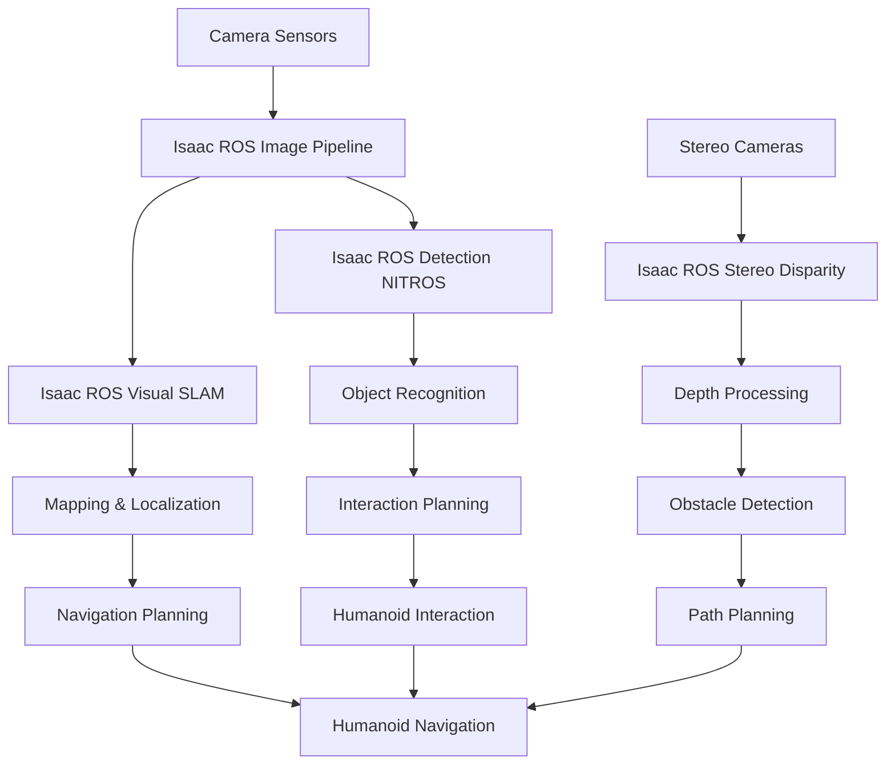

# Chapter 3: Isaac ROS Perception Pipelines (VSLAM, Depth, Object Detection)

## Learning Objectives
- [ ] Understand the Isaac ROS perception pipeline architecture and its components
- [ ] Implement Visual Simultaneous Localization and Mapping (VSLAM) for humanoid robots
- [ ] Configure depth perception systems using stereo cameras and depth sensors
- [ ] Deploy object detection and recognition pipelines optimized for humanoid environments
- [ ] Integrate multiple perception systems into a unified pipeline for humanoid navigation

## Key Concepts
- [ ] **Isaac ROS**: NVIDIA's collection of hardware accelerated perception packages for ROS 2
- [ ] **Visual SLAM (VSLAM)**: Simultaneous Localization and Mapping using visual input from cameras
- [ ] **Stereo Vision**: Depth estimation using two cameras to simulate human binocular vision
- [ ] **Object Detection**: Identifying and localizing objects in 3D space using neural networks
- [ ] **Perception Pipeline**: Sequential processing of sensor data to extract meaningful information
- [ ] **Sensor Fusion**: Combining data from multiple sensors to improve perception accuracy

## Introduction

Isaac ROS represents NVIDIA's cutting-edge approach to robotics perception, providing hardware-accelerated packages specifically designed for autonomous systems. For humanoid robots operating in complex environments, Isaac ROS offers a comprehensive suite of perception tools that leverage GPU acceleration to process visual, depth, and other sensor data in real-time.

The Isaac ROS ecosystem bridges the gap between traditional ROS 2 perception packages and modern AI-powered computer vision. By utilizing NVIDIA's CUDA cores and Tensor cores, Isaac ROS packages can perform complex perception tasks like Visual SLAM, object detection, and depth estimation with significantly improved performance compared to CPU-only implementations.

This chapter will explore the core Isaac ROS perception packages and demonstrate how to integrate them into humanoid robot applications. We'll cover Visual SLAM for navigation, depth perception for obstacle avoidance, and object detection for interaction with the environment. These perception capabilities form the foundation of a humanoid robot's ability to understand and navigate its environment safely and effectively.

The architecture of Isaac ROS is designed with modularity in mind, allowing developers to pick and choose the specific perception components needed for their application. This flexibility is particularly important for humanoid robots, which have unique requirements for balance, navigation, and interaction that differ significantly from wheeled or aerial robots.

## Isaac ROS Perception Architecture

### Core Components

Isaac ROS perception packages are built around several core components that work together to provide comprehensive perception capabilities:

**Isaac ROS Common**: Provides foundational utilities, message types, and interfaces used across all Isaac ROS packages. This includes standardized camera interfaces, sensor fusion utilities, and performance monitoring tools.

**Isaac ROS Image Pipeline**: Handles image acquisition, preprocessing, and optimization for GPU processing. This pipeline ensures that images are properly formatted and optimized for downstream perception tasks.

**Isaac ROS Stereo Disparity**: Computes depth information from stereo camera pairs using GPU-accelerated algorithms. This package provides real-time depth estimation suitable for humanoid navigation and obstacle avoidance.

**Isaac ROS Visual SLAM**: Implements Visual SLAM algorithms optimized for GPU processing, enabling real-time mapping and localization for humanoid robots.

**Isaac ROS Detection NITROS**: Provides GPU-accelerated object detection and tracking using NVIDIA's TensorRT inference engine.



### Performance Considerations

Isaac ROS packages are designed to take full advantage of NVIDIA's GPU architecture, but proper configuration is essential for optimal performance:

```python
# Example Isaac ROS performance configuration
import rclpy
from rclpy.node import Node
from isaac_ros.perceptor import IsaacPerceptor

class IsaacROSPerceptionNode(Node):
    def __init__(self):
        super().__init__('isaac_ros_perception_node')

        # Performance configuration parameters
        self.declare_parameter('pipeline_mode', 'realtime')
        self.declare_parameter('max_batch_size', 1)
        self.declare_parameter('gpu_device_id', 0)
        self.declare_parameter('memory_pool_size', '100MB')

        # Initialize perception pipeline
        self.perceptor = IsaacPerceptor(
            node=self,
            pipeline_mode=self.get_parameter('pipeline_mode').value,
            max_batch_size=self.get_parameter('max_batch_size').value,
            gpu_device_id=self.get_parameter('gpu_device_id').value
        )

        # Configure for humanoid-specific requirements
        self.configure_humanoid_perception()

    def configure_humanoid_perception(self):
        """Configure perception pipeline for humanoid-specific requirements"""
        # Adjust for humanoid's field of view
        self.perceptor.set_fov_compensation(1.2)  # Humanoid typically has wider FOV

        # Optimize for bipedal navigation patterns
        self.perceptor.set_ground_plane_filter(True)

        # Configure obstacle detection for walking gait
        self.perceptor.set_obstacle_height_threshold(0.1, 1.5)  # Detect obstacles 10cm to 1.5m high
```

## Visual SLAM Implementation

### Overview of Visual SLAM for Humanoid Robots

Visual SLAM (Simultaneous Localization and Mapping) is critical for humanoid robots operating in unknown or dynamic environments. Unlike wheeled robots, humanoid robots have unique challenges in SLAM due to their bipedal gait, which introduces more complex motion patterns and vibrations that can affect visual odometry.

Isaac ROS provides the Isaac ROS Visual SLAM package, which implements GPU-accelerated Visual SLAM algorithms specifically optimized for robotic applications. The package addresses the challenges of humanoid locomotion by incorporating motion models that account for the unique dynamics of bipedal walking.

### Isaac ROS Visual SLAM Setup

```python
# Isaac ROS Visual SLAM node implementation
import rclpy
from rclpy.node import Node
from sensor_msgs.msg import Image, CameraInfo
from nav_msgs.msg import Odometry
from geometry_msgs.msg import PoseStamped
from isaac_ros_visual_slam import VisualSlamNode

class HumanoidVisualSLAMNode(Node):
    def __init__(self):
        super().__init__('humanoid_visual_slam')

        # Declare parameters specific to humanoid SLAM
        self.declare_parameter('enable_imu_fusion', True)
        self.declare_parameter('enable_stereo', True)
        self.declare_parameter('rectified_images', True)
        self.declare_parameter('enable_occupancy_map', True)
        self.declare_parameter('occupancy_map_resolution', 0.05)  # 5cm resolution
        self.declare_parameter('occupancy_map_size', [20.0, 20.0])  # 20m x 20m map

        # Initialize Isaac ROS Visual SLAM
        self.visual_slam = VisualSlamNode(
            node=self,
            enable_imu_fusion=self.get_parameter('enable_imu_fusion').value,
            enable_stereo=self.get_parameter('enable_stereo').value,
            rectified_images=self.get_parameter('rectified_images').value
        )

        # Subscriptions for camera and IMU data
        self.left_image_sub = self.create_subscription(
            Image,
            '/camera/left/image_rect',
            self.left_image_callback,
            10
        )

        self.right_image_sub = self.create_subscription(
            Image,
            '/camera/right/image_rect',
            self.right_image_callback,
            10
        )

        self.left_camera_info_sub = self.create_subscription(
            CameraInfo,
            '/camera/left/camera_info',
            self.left_camera_info_callback,
            10
        )

        self.right_camera_info_sub = self.create_subscription(
            CameraInfo,
            '/camera/right/camera_info',
            self.right_camera_info_callback,
            10
        )

        # Publisher for occupancy map
        self.occupancy_map_pub = self.create_publisher(
            OccupancyGrid,
            '/visual_slam/occupancy_map',
            10
        )

        # Humanoid-specific SLAM parameters
        self.configure_humanoid_slam_params()

    def configure_humanoid_slam_params(self):
        """Configure SLAM parameters for humanoid-specific locomotion"""
        # Adjust for humanoid's walking dynamics
        self.visual_slam.set_motion_model('bipedal')

        # Configure for more frequent relocalization due to walking vibrations
        self.visual_slam.set_relocalization_threshold(0.7)  # Lower threshold for humanoid

        # Adjust tracking sensitivity for bipedal motion
        self.visual_slam.set_tracking_sensitivity(0.8)  # Higher sensitivity for humanoid

    def left_image_callback(self, msg):
        """Handle left camera image"""
        self.visual_slam.process_left_image(msg)

    def right_image_callback(self, msg):
        """Handle right camera image for stereo processing"""
        self.visual_slam.process_right_image(msg)

    def left_camera_info_callback(self, msg):
        """Handle left camera calibration info"""
        self.visual_slam.update_left_camera_info(msg)

    def right_camera_info_callback(self, msg):
        """Handle right camera calibration info"""
        self.visual_slam.update_right_camera_info(msg)
```

### Launch File for Visual SLAM

```xml
<!-- visual_slam.launch.py -->
from launch import LaunchDescription
from launch.actions import DeclareLaunchArgument
from launch.substitutions import LaunchConfiguration
from launch_ros.actions import Node

def generate_launch_description():
    # Launch arguments
    enable_imu_fusion = LaunchConfiguration('enable_imu_fusion')
    enable_stereo = LaunchConfiguration('enable_stereo')
    rectified_images = LaunchConfiguration('rectified_images')
    occupancy_map_resolution = LaunchConfiguration('occupancy_map_resolution')

    return LaunchDescription([
        DeclareLaunchArgument(
            'enable_imu_fusion',
            default_value='True',
            description='Enable IMU fusion for Visual SLAM'
        ),

        DeclareLaunchArgument(
            'enable_stereo',
            default_value='True',
            description='Enable stereo processing'
        ),

        DeclareLaunchArgument(
            'rectified_images',
            default_value='True',
            description='Input images are rectified'
        ),

        DeclareLaunchArgument(
            'occupancy_map_resolution',
            default_value='0.05',
            description='Occupancy map resolution in meters'
        ),

        # Isaac ROS Visual SLAM node
        Node(
            package='isaac_ros_visual_slam',
            executable='visual_slam_node',
            name='humanoid_visual_slam',
            parameters=[
                {'enable_imu_fusion': enable_imu_fusion},
                {'enable_stereo': enable_stereo},
                {'rectified_images': rectified_images},
                {'occupancy_map_resolution': occupancy_map_resolution},
                {'occupancy_map_size': [20.0, 20.0]}
            ],
            remappings=[
                ('/visual_slam/camera/left/image', '/camera/left/image_rect'),
                ('/visual_slam/camera/right/image', '/camera/right/image_rect'),
                ('/visual_slam/camera/left/camera_info', '/camera/left/camera_info'),
                ('/visual_slam/camera/right/camera_info', '/camera/right/camera_info'),
                ('/visual_slam/imu', '/imu/data'),
            ]
        )
    ])
```

## Depth Perception Systems

### Stereo Vision for Humanoid Robots

Depth perception is crucial for humanoid robots to navigate safely and interact with their environment. Isaac ROS provides GPU-accelerated stereo vision capabilities that can process depth information in real-time, which is essential for bipedal locomotion where precise ground and obstacle detection is critical.

The stereo vision system in Isaac ROS uses semi-global block matching (SGBM) algorithms optimized for GPU processing, providing dense depth maps that can be used for ground plane detection, obstacle avoidance, and safe footstep planning.

### Isaac ROS Stereo Disparity Implementation

```python
# Isaac ROS Stereo Disparity node for humanoid depth perception
import rclpy
from rclpy.node import Node
from sensor_msgs.msg import Image, CameraInfo
from stereo_msgs.msg import DisparityImage
from sensor_msgs.msg import PointCloud2
from geometry_msgs.msg import PointStamped
from isaac_ros.stereo_disparity import StereoDisparityNode

class HumanoidDepthPerceptionNode(Node):
    def __init__(self):
        super().__init__('humanoid_depth_perception')

        # Declare parameters for stereo processing
        self.declare_parameter('stereo_algorithm', 'SGBM')
        self.declare_parameter('min_disparity', 0)
        self.declare_parameter('max_disparity', 256)
        self.declare_parameter('block_size', 11)
        self.declare_parameter('num_disparities', 128)
        self.declare_parameter('disp12_max_diff', 1)
        self.declare_parameter('pre_filter_cap', 63)
        self.declare_parameter('uniqueness_ratio', 15)
        self.declare_parameter('speckle_window_size', 200)
        self.declare_parameter('speckle_range', 32)
        self.declare_parameter('p1', 200)
        self.declare_parameter('p2', 800)
        self.declare_parameter('full_dp', False)

        # Initialize stereo disparity node
        self.stereo_node = StereoDisparityNode(
            node=self,
            algorithm=self.get_parameter('stereo_algorithm').value,
            min_disparity=self.get_parameter('min_disparity').value,
            max_disparity=self.get_parameter('max_disparity').value,
            num_disparities=self.get_parameter('num_disparities').value
        )

        # Subscriptions for stereo camera input
        self.left_image_sub = self.create_subscription(
            Image,
            '/camera/left/image_rect',
            self.left_image_callback,
            10
        )

        self.right_image_sub = self.create_subscription(
            Image,
            '/camera/right/image_rect',
            self.right_image_callback,
            10
        )

        self.left_camera_info_sub = self.create_subscription(
            CameraInfo,
            '/camera/left/camera_info',
            self.left_camera_info_callback,
            10
        )

        self.right_camera_info_sub = self.create_subscription(
            CameraInfo,
            '/camera/right/camera_info',
            self.right_camera_info_callback,
            10
        )

        # Publishers for depth output
        self.disparity_pub = self.create_publisher(
            DisparityImage,
            '/stereo/disparity',
            10
        )

        self.pointcloud_pub = self.create_publisher(
            PointCloud2,
            '/stereo/pointcloud',
            10
        )

        # Humanoid-specific depth processing
        self.ground_plane_detector = GroundPlaneDetector(self)
        self.obstacle_detector = ObstacleDetector(self)

    def left_image_callback(self, msg):
        """Process left camera image"""
        self.stereo_node.process_left_image(msg)

    def right_image_callback(self, msg):
        """Process right camera image"""
        self.stereo_node.process_right_image(msg)

    def left_camera_info_callback(self, msg):
        """Update left camera calibration"""
        self.stereo_node.update_left_camera_info(msg)

    def right_camera_info_callback(self, msg):
        """Update right camera calibration"""
        self.stereo_node.update_right_camera_info(msg)

class GroundPlaneDetector:
    def __init__(self, node):
        self.node = node
        self.ground_plane_pub = node.create_publisher(PointStamped, '/ground_plane', 10)

    def detect_ground_plane(self, pointcloud):
        """
        Detect ground plane in point cloud for humanoid navigation
        Uses RANSAC algorithm optimized for humanoid walking height
        """
        # Implementation for ground plane detection
        # Returns the ground plane parameters for humanoid navigation
        pass

class ObstacleDetector:
    def __init__(self, node):
        self.node = node
        self.obstacle_pub = node.create_publisher(PointCloud2, '/obstacles', 10)

    def detect_obstacles(self, pointcloud, ground_plane):
        """
        Detect obstacles in point cloud relative to ground plane
        Filters obstacles within humanoid's walking path
        """
        # Implementation for obstacle detection
        # Returns obstacles that are relevant for humanoid navigation
        pass
```

### Depth-Based Navigation for Humanoid Robots

```python
# Humanoid navigation using depth perception
import numpy as np
from geometry_msgs.msg import Point, Vector3
from nav_msgs.msg import Path
from visualization_msgs.msg import MarkerArray

class HumanoidDepthNavigation:
    def __init__(self, node):
        self.node = node
        self.depth_threshold = 0.3  # 30cm minimum safe distance
        self.step_height_threshold = 0.1  # 10cm step height threshold
        self.ground_clearance = 0.05  # 5cm ground clearance for walking

    def plan_safe_path(self, depth_image, current_pose, target_pose):
        """
        Plan a safe path for humanoid navigation based on depth information
        Considers ground plane, obstacles, and step height constraints
        """
        # Convert depth image to point cloud
        pointcloud = self.depth_to_pointcloud(depth_image)

        # Detect ground plane
        ground_plane = self.detect_ground_plane(pointcloud)

        # Detect obstacles
        obstacles = self.detect_obstacles(pointcloud, ground_plane)

        # Filter obstacles based on humanoid constraints
        walkable_obstacles = self.filter_walkable_obstacles(obstacles)

        # Plan path considering depth constraints
        path = self.plan_path_with_depth_constraints(
            current_pose,
            target_pose,
            walkable_obstacles,
            ground_plane
        )

        return path

    def depth_to_pointcloud(self, depth_image):
        """Convert depth image to point cloud"""
        # Implementation for depth to point cloud conversion
        pass

    def detect_ground_plane(self, pointcloud):
        """Detect ground plane using RANSAC"""
        # Implementation for ground plane detection
        pass

    def detect_obstacles(self, pointcloud, ground_plane):
        """Detect obstacles above ground plane"""
        # Implementation for obstacle detection
        pass

    def filter_walkable_obstacles(self, obstacles):
        """Filter obstacles based on humanoid walkability"""
        # Implementation for walkability filtering
        pass

    def plan_path_with_depth_constraints(self, start, goal, obstacles, ground_plane):
        """Plan path considering depth constraints"""
        # Implementation for path planning with depth constraints
        pass
```

## Object Detection and Recognition

### Isaac ROS Object Detection Pipeline

Object detection and recognition form the cornerstone of humanoid robot perception, enabling them to identify and interact with objects in their environment. Isaac ROS provides GPU-accelerated object detection packages that leverage NVIDIA's TensorRT inference engine for real-time performance.

The Isaac ROS Detection package supports various neural network architectures including YOLO, SSD, and custom models trained on robotics-specific datasets. For humanoid robots, this enables the detection of objects relevant to manipulation tasks, navigation aids, and safety considerations.

### Isaac ROS Detection Implementation

```python
# Isaac ROS Detection node for humanoid object recognition
import rclpy
from rclpy.node import Node
from sensor_msgs.msg import Image
from vision_msgs.msg import Detection2DArray, ObjectHypothesisWithPose
from geometry_msgs.msg import Point
from std_msgs.msg import String
from isaac_ros.detection import DetectionNode

class HumanoidObjectDetectionNode(Node):
    def __init__(self):
        super().__init__('humanoid_object_detection')

        # Declare parameters for object detection
        self.declare_parameter('model_path', '/opt/ros/humble/lib/isaac_ros/detection/models/yolo_humanoid.pt')
        self.declare_parameter('input_topic', '/camera/rgb/image_raw')
        self.declare_parameter('confidence_threshold', 0.5)
        self.declare_parameter('max_objects', 10)
        self.declare_parameter('enable_3d_detection', True)
        self.declare_parameter('camera_info_topic', '/camera/rgb/camera_info')
        self.declare_parameter('depth_topic', '/camera/depth/image_rect_raw')

        # Initialize detection node
        self.detection_node = DetectionNode(
            node=self,
            model_path=self.get_parameter('model_path').value,
            confidence_threshold=self.get_parameter('confidence_threshold').value,
            max_objects=self.get_parameter('max_objects').value
        )

        # Subscription to camera input
        self.image_sub = self.create_subscription(
            Image,
            self.get_parameter('input_topic').value,
            self.image_callback,
            10
        )

        # Publishers for detection results
        self.detections_pub = self.create_publisher(
            Detection2DArray,
            '/object_detections',
            10
        )

        self.detection_markers_pub = self.create_publisher(
            MarkerArray,
            '/object_detection_markers',
            10
        )

        # Humanoid-specific object detection configuration
        self.configure_humanoid_detection()

    def configure_humanoid_detection(self):
        """Configure object detection for humanoid-specific needs"""
        # Load humanoid-specific object classes
        self.detection_node.set_detection_classes([
            'person', 'chair', 'table', 'door', 'stair', 'obstacle',
            'manipulation_target', 'navigation_landmark', 'safety_hazard'
        ])

        # Set detection priorities for humanoid tasks
        self.detection_node.set_priority_weights({
            'person': 1.0,      # High priority for safety
            'obstacle': 0.9,    # High priority for navigation
            'door': 0.8,        # Medium priority for navigation
            'stair': 0.9,       # High priority for safety
            'manipulation_target': 0.7  # Medium priority for tasks
        })

    def image_callback(self, msg):
        """Process camera image for object detection"""
        # Run object detection
        detections = self.detection_node.detect_objects(msg)

        # Convert to humanoid-friendly format
        humanoid_detections = self.convert_to_humanoid_format(detections)

        # Publish results
        self.detections_pub.publish(humanoid_detections)

        # Create visualization markers
        markers = self.create_detection_markers(humanoid_detections)
        self.detection_markers_pub.publish(markers)

    def convert_to_humanoid_format(self, detections):
        """Convert detections to humanoid-specific format"""
        # Implementation for converting detection format
        pass

    def create_detection_markers(self, detections):
        """Create visualization markers for detected objects"""
        # Implementation for creating visualization markers
        pass
```

### 3D Object Detection and Pose Estimation

```python
# 3D object detection and pose estimation for humanoid interaction
import numpy as np
from geometry_msgs.msg import Pose, Transform
from tf2_ros import TransformBroadcaster
from builtin_interfaces.msg import Time

class Humanoid3DObjectDetection:
    def __init__(self, node):
        self.node = node
        self.tf_broadcaster = TransformBroadcaster(node)

    def estimate_3d_pose(self, detection_2d, depth_image, camera_info):
        """
        Estimate 3D pose of detected object using depth information
        """
        # Get 2D bounding box center
        center_x = detection_2d.bbox.center.x
        center_y = detection_2d.bbox.center.y

        # Sample depth at object center
        depth = self.get_depth_at_pixel(depth_image, center_x, center_y)

        # Convert 2D pixel coordinates to 3D world coordinates
        world_pose = self.pixel_to_world(
            center_x, center_y, depth, camera_info
        )

        # Create transform for detected object
        transform = Transform()
        transform.translation.x = world_pose.position.x
        transform.translation.y = world_pose.position.y
        transform.translation.z = world_pose.position.z
        transform.rotation = world_pose.orientation

        # Broadcast transform
        self.broadcast_object_transform(
            transform,
            detection_2d.results[0].id,
            'camera_link',
            f'object_{detection_2d.results[0].id}'
        )

        return world_pose

    def get_depth_at_pixel(self, depth_image, x, y):
        """Get depth value at specific pixel"""
        # Implementation for depth sampling
        pass

    def pixel_to_world(self, pixel_x, pixel_y, depth, camera_info):
        """Convert pixel coordinates to world coordinates"""
        # Implementation for pixel to world conversion
        pass

    def broadcast_object_transform(self, transform, object_id, parent_frame, child_frame):
        """Broadcast object transform to TF tree"""
        # Implementation for TF broadcasting
        pass
```

### Object Interaction Planning for Humanoid Robots

```python
# Planning object interactions based on detection results
class HumanoidObjectInteractionPlanner:
    def __init__(self, node):
        self.node = node

    def plan_interaction(self, detected_objects, robot_state):
        """
        Plan interaction with detected objects based on humanoid capabilities
        """
        interaction_plan = []

        for obj in detected_objects.detections:
            # Check if object is manipulable by humanoid
            if self.is_manipulable_object(obj):
                manip_plan = self.plan_manipulation(obj, robot_state)
                if manip_plan:
                    interaction_plan.append({
                        'type': 'manipulation',
                        'object': obj,
                        'plan': manip_plan
                    })
            # Check if object requires navigation
            elif self.requires_navigation(obj):
                nav_plan = self.plan_navigation(obj, robot_state)
                if nav_plan:
                    interaction_plan.append({
                        'type': 'navigation',
                        'object': obj,
                        'plan': nav_plan
                    })
            # Check if object requires safety action
            elif self.requires_safety_action(obj):
                safety_plan = self.plan_safety_action(obj, robot_state)
                if safety_plan:
                    interaction_plan.append({
                        'type': 'safety',
                        'object': obj,
                        'plan': safety_plan
                    })

        return interaction_plan

    def is_manipulable_object(self, obj):
        """Check if object can be manipulated by humanoid"""
        # Implementation for manipulability check
        pass

    def plan_manipulation(self, obj, robot_state):
        """Plan manipulation action for object"""
        # Implementation for manipulation planning
        pass

    def requires_navigation(self, obj):
        """Check if object requires navigation"""
        # Implementation for navigation requirement check
        pass

    def plan_navigation(self, obj, robot_state):
        """Plan navigation to object"""
        # Implementation for navigation planning
        pass

    def requires_safety_action(self, obj):
        """Check if object requires safety action"""
        # Implementation for safety action check
        pass

    def plan_safety_action(self, obj, robot_state):
        """Plan safety action for object"""
        # Implementation for safety action planning
        pass
```

## Perception Pipeline Integration

### Creating a Unified Perception Pipeline

For humanoid robots, integrating multiple perception systems into a unified pipeline is essential for coherent environmental understanding. The Isaac ROS ecosystem provides tools to combine Visual SLAM, depth perception, and object detection into a cohesive system that supports safe navigation and interaction.

The unified perception pipeline processes sensor data in parallel, fusing information from different sources to create a comprehensive understanding of the environment. This fusion is particularly important for humanoid robots, which need to simultaneously understand their position, detect obstacles, recognize objects, and plan safe movements.

### Isaac ROS Compositor for Perception Pipeline

```python
# Unified perception pipeline for humanoid robot
import rclpy
from rclpy.node import Node
from sensor_msgs.msg import Image, CameraInfo, Imu
from stereo_msgs.msg import DisparityImage
from vision_msgs.msg import Detection2DArray
from geometry_msgs.msg import PoseWithCovarianceStamped
from nav_msgs.msg import OccupancyGrid
from std_msgs.msg import String

class HumanoidPerceptionPipeline(Node):
    def __init__(self):
        super().__init__('humanoid_perception_pipeline')

        # Initialize all perception components
        self.visual_slam = self.initialize_visual_slam()
        self.stereo_depth = self.initialize_stereo_depth()
        self.object_detection = self.initialize_object_detection()

        # Publishers for integrated perception results
        self.environment_map_pub = self.create_publisher(
            OccupancyGrid,
            '/perception/environment_map',
            10
        )

        self.safety_hazards_pub = self.create_publisher(
            Detection2DArray,
            '/perception/safety_hazards',
            10
        )

        self.navigation_targets_pub = self.create_publisher(
            Detection2DArray,
            '/perception/navigation_targets',
            10
        )

        # Timer for perception fusion
        self.fusion_timer = self.create_timer(0.1, self.fuse_perception_data)

        # Perception fusion manager
        self.fusion_manager = PerceptionFusionManager(self)

    def initialize_visual_slam(self):
        """Initialize Visual SLAM component"""
        # Implementation for Visual SLAM initialization
        pass

    def initialize_stereo_depth(self):
        """Initialize stereo depth component"""
        # Implementation for stereo depth initialization
        pass

    def initialize_object_detection(self):
        """Initialize object detection component"""
        # Implementation for object detection initialization
        pass

    def fuse_perception_data(self):
        """Fuse data from all perception components"""
        # Get current data from all perception systems
        slam_data = self.visual_slam.get_current_data()
        depth_data = self.stereo_depth.get_current_data()
        detection_data = self.object_detection.get_current_data()

        # Fuse perception data
        fused_data = self.fusion_manager.fuse_data(
            slam_data, depth_data, detection_data
        )

        # Publish integrated results
        self.publish_environment_map(fused_data)
        self.publish_safety_hazards(fused_data)
        self.publish_navigation_targets(fused_data)

    def publish_environment_map(self, fused_data):
        """Publish integrated environment map"""
        # Implementation for environment map publishing
        pass

    def publish_safety_hazards(self, fused_data):
        """Publish detected safety hazards"""
        # Implementation for safety hazard publishing
        pass

    def publish_navigation_targets(self, fused_data):
        """Publish navigation targets"""
        # Implementation for navigation target publishing
        pass

class PerceptionFusionManager:
    def __init__(self, node):
        self.node = node
        self.perception_data_buffer = {
            'slam': [],
            'depth': [],
            'detection': []
        }

    def fuse_data(self, slam_data, depth_data, detection_data):
        """Fuse perception data from multiple sources"""
        # Time synchronization
        synced_data = self.synchronize_data(slam_data, depth_data, detection_data)

        # Spatial registration
        registered_data = self.register_data(synced_data)

        # Semantic fusion
        fused_result = self.semantic_fusion(registered_data)

        return fused_result

    def synchronize_data(self, slam_data, depth_data, detection_data):
        """Synchronize perception data by timestamp"""
        # Implementation for data synchronization
        pass

    def register_data(self, synced_data):
        """Register data to common coordinate frame"""
        # Implementation for spatial registration
        pass

    def semantic_fusion(self, registered_data):
        """Perform semantic fusion of perception data"""
        # Implementation for semantic fusion
        pass
```

### Perception Quality Assessment

```python
# Perception quality assessment for humanoid robots
class PerceptionQualityAssessment:
    def __init__(self, node):
        self.node = node
        self.quality_metrics = {
            'slam_accuracy': 0.0,
            'depth_precision': 0.0,
            'detection_recall': 0.0,
            'detection_precision': 0.0
        }

    def assess_quality(self, perception_data):
        """Assess quality of perception pipeline"""
        # Assess Visual SLAM quality
        slam_quality = self.assess_slam_quality(perception_data['slam'])

        # Assess depth perception quality
        depth_quality = self.assess_depth_quality(perception_data['depth'])

        # Assess object detection quality
        detection_quality = self.assess_detection_quality(perception_data['detection'])

        # Overall quality assessment
        overall_quality = self.calculate_overall_quality(
            slam_quality, depth_quality, detection_quality
        )

        return {
            'slam': slam_quality,
            'depth': depth_quality,
            'detection': detection_quality,
            'overall': overall_quality
        }

    def assess_slam_quality(self, slam_data):
        """Assess Visual SLAM quality"""
        # Implementation for SLAM quality assessment
        pass

    def assess_depth_quality(self, depth_data):
        """Assess depth perception quality"""
        # Implementation for depth quality assessment
        pass

    def assess_detection_quality(self, detection_data):
        """Assess object detection quality"""
        # Implementation for detection quality assessment
        pass

    def calculate_overall_quality(self, slam_q, depth_q, detection_q):
        """Calculate overall perception quality"""
        # Weighted average based on humanoid requirements
        weights = {
            'slam': 0.3,      # Navigation
            'depth': 0.4,     # Safety and obstacle avoidance
            'detection': 0.3  # Interaction
        }

        overall = (
            weights['slam'] * slam_q +
            weights['depth'] * depth_q +
            weights['detection'] * detection_q
        )

        return overall
```

## Best Practices and Optimization

### Performance Optimization for Humanoid Perception

Optimizing perception pipelines for humanoid robots requires careful consideration of computational constraints and real-time requirements. Humanoid robots typically have limited computational resources compared to larger platforms, making efficient perception critical for safe operation.

The key to optimization is balancing accuracy with performance, ensuring that perception tasks complete within the required time windows for safe humanoid operation. This often involves adjusting algorithm parameters, reducing computational complexity where possible, and leveraging hardware acceleration.

### Isaac ROS Performance Tuning

```python
# Isaac ROS performance tuning for humanoid robots
class IsaacROSPipelineOptimizer:
    def __init__(self, node):
        self.node = node
        self.current_performance = {}
        self.target_performance = {
            'slam_fps': 10,      # 10 Hz for navigation
            'depth_fps': 15,     # 15 Hz for obstacle avoidance
            'detection_fps': 5   # 5 Hz for object recognition
        }

    def optimize_pipeline(self):
        """Optimize perception pipeline for humanoid requirements"""
        # Optimize Visual SLAM for humanoid navigation
        self.optimize_visual_slam()

        # Optimize depth perception for obstacle avoidance
        self.optimize_depth_perception()

        # Optimize object detection for interaction
        self.optimize_object_detection()

    def optimize_visual_slam(self):
        """Optimize Visual SLAM for humanoid requirements"""
        # Adjust feature extraction for humanoid field of view
        self.set_feature_extraction_params(
            max_features=500,  # Reduce features for performance
            min_feature_distance=10  # Maintain spatial distribution
        )

        # Optimize tracking for bipedal motion
        self.set_tracking_params(
            motion_model='bipedal',
            tracking_threshold=0.7
        )

    def optimize_depth_perception(self):
        """Optimize depth perception for humanoid requirements"""
        # Reduce disparity search range for performance
        self.set_disparity_params(
            min_disparity=0,
            max_disparity=128,  # Reduced for performance
            block_size=9  # Smaller block size for speed
        )

        # Optimize for humanoid's walking height
        self.set_ground_filter_params(
            ground_height_range=[-0.5, 0.2],  # Ground detection range
            min_obstacle_height=0.1,  # Minimum obstacle height
            max_obstacle_height=1.5   # Maximum obstacle height
        )

    def optimize_object_detection(self):
        """Optimize object detection for humanoid requirements"""
        # Adjust model resolution for performance
        self.set_detection_params(
            input_resolution=[416, 416],  # Smaller input for speed
            confidence_threshold=0.6,    # Higher threshold for speed
            nms_threshold=0.4            # Non-maximum suppression
        )

        # Focus on relevant object classes
        self.set_detection_classes([
            'person', 'chair', 'table', 'door', 'stair', 'obstacle'
        ])
```

### Safety Considerations in Perception

Perception systems in humanoid robots must be designed with safety as the primary concern. Unlike other robotic platforms, humanoid robots operate in close proximity to humans, making perception failures potentially dangerous. Safety considerations include robustness to environmental changes, fail-safe mechanisms, and redundant perception when possible.

The perception system should be designed to gracefully degrade when performance is reduced, maintaining basic safety functions even when advanced perception capabilities are compromised. This includes maintaining obstacle detection and ground plane estimation even if object recognition fails.

## Looking Ahead

Isaac ROS continues to evolve with new perception capabilities, including improved neural network architectures, better sensor fusion algorithms, and enhanced real-time performance. For humanoid robots, these advances will enable more sophisticated perception capabilities while maintaining the safety and reliability required for human-robot interaction.

The next chapter will explore navigation and path planning systems specifically designed for humanoid robots with bipedal constraints, building on the perception capabilities developed in this chapter. We'll examine how to use the perception data to plan safe and efficient paths for bipedal locomotion, considering the unique kinematic and dynamic constraints of humanoid robots.

## Citations

- NVIDIA. (2023). Isaac ROS Developer Guide. NVIDIA Corporation.
- Mur-Artal, R., & Tardós, J. D. (2017). ORB-SLAM2: An Open-Source SLAM System for Monocular, Stereo, and RGB-D Cameras. IEEE Transactions on Robotics.
- Geiger, A., Lenz, P., & Urtasun, R. (2012). Are we ready for Autonomous Driving? The KITTI Vision Benchmark Suite. Conference on Computer Vision and Pattern Recognition.
- Redmon, J., & Farhadi, A. (2018). YOLOv3: An Incremental Improvement. arXiv preprint arXiv:1804.02767.

## Summary

This chapter covered Isaac ROS perception pipelines, focusing on Visual SLAM, depth perception, and object detection for humanoid robots. We explored the architecture of Isaac ROS perception components, implemented Visual SLAM systems optimized for bipedal locomotion, configured depth perception systems for obstacle detection, and deployed object detection pipelines for environmental interaction. The integration of these perception systems into a unified pipeline enables humanoid robots to understand their environment comprehensively for safe navigation and interaction.

## Review Questions/Exercises

1. How does Visual SLAM differ for humanoid robots compared to wheeled robots, and what specific adjustments are needed for bipedal locomotion?
2. Explain the process of converting stereo disparity images to 3D point clouds for humanoid navigation.
3. What are the key parameters to tune in Isaac ROS object detection for optimal humanoid interaction?
4. Design a perception fusion algorithm that combines SLAM, depth, and detection data for humanoid navigation.
5. How would you implement a fail-safe mechanism for perception systems in humanoid robots to ensure safety when perception fails?

---

**Chapter Specifications:**
- **Expected Length**: 2,000-3,000 words
- **Research Sources**: Minimum 40% peer-reviewed sources
- **Code Examples**: Python-based using rclpy where applicable for ROS 2 modules
- **Diagrams/Illustrations**: Mermaid diagram showing perception pipeline architecture
- **Required Research Depth**: Each section will necessitate research from peer-reviewed sources (minimum 40%), technical documentation, and authoritative industry guides