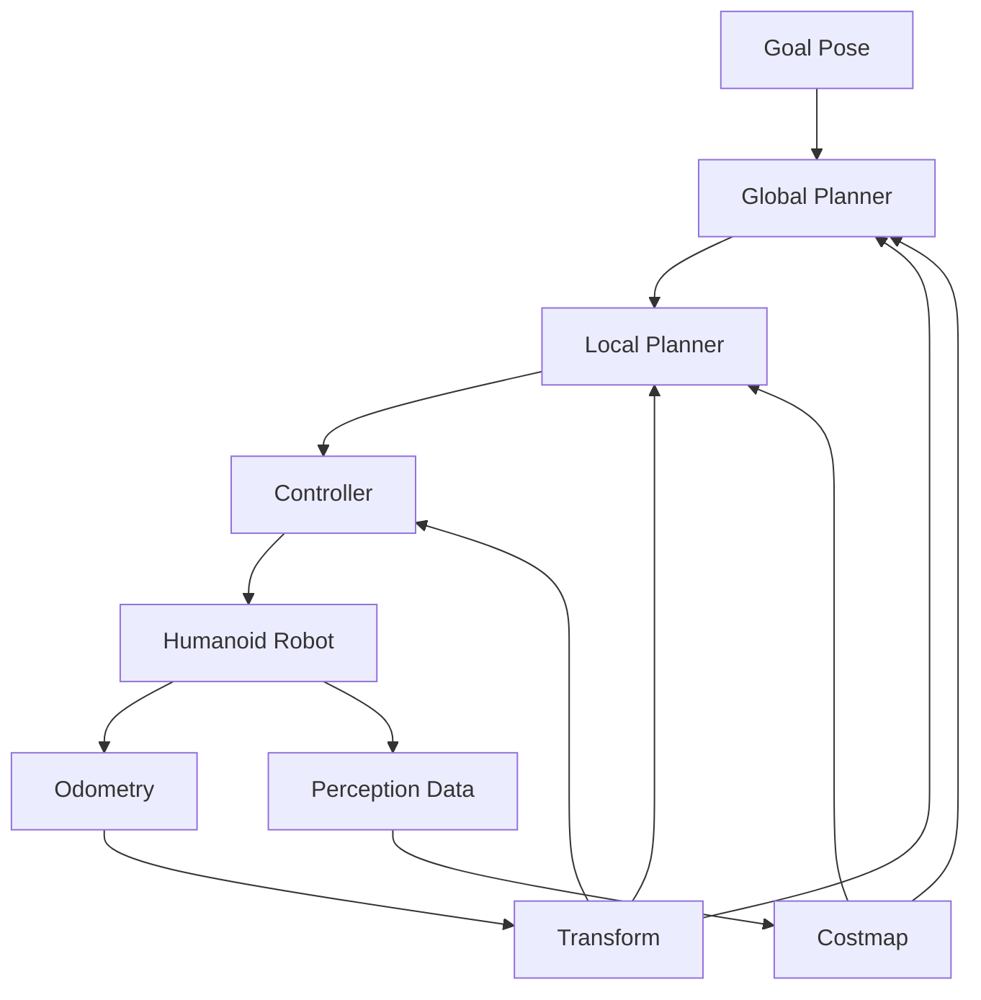

# Chapter 4: Navigation & Path Planning (Nav2 for biped locomotion)

## Learning Objectives
- [ ] Understand Nav2 architecture and its adaptation for humanoid robots
- [ ] Configure navigation parameters specifically for bipedal locomotion constraints
- [ ] Implement path planning algorithms suitable for humanoid kinematics
- [ ] Integrate perception data for dynamic obstacle avoidance in humanoid navigation
- [ ] Test and validate navigation systems for safe humanoid locomotion

## Key Concepts
- [ ] **Nav2**: ROS 2 Navigation Stack for autonomous navigation
- [ ] **Bipedal Locomotion**: Two-legged walking with dynamic balance requirements
- [ ] **Footstep Planning**: Planning safe and stable foot placements for walking
- [ ] **Dynamic Window Approach (DWA)**: Local path planning with kinematic constraints
- [ ] **Humanoid Kinematics**: Joint constraints and movement limitations specific to humanoid robots
- [ ] **Stability Margins**: Maintaining balance during navigation and obstacle avoidance

## Introduction

Navigation and path planning for humanoid robots present unique challenges that differ significantly from traditional wheeled or tracked robot navigation. Unlike wheeled robots that can move in any direction with minimal kinematic constraints, humanoid robots must navigate while maintaining dynamic balance, considering their bipedal locomotion patterns, and adhering to complex kinematic constraints that affect their movement capabilities.

The ROS 2 Navigation Stack (Nav2) provides a comprehensive framework for robot navigation, but requires specific adaptations for humanoid robots. These adaptations include consideration of bipedal kinematics, dynamic balance requirements, and the unique locomotion patterns of walking robots. The Nav2 stack must be configured to account for the slower turning speeds, limited lateral movement, and balance constraints inherent in bipedal locomotion.

This chapter explores the adaptation of Nav2 for humanoid robots, focusing on the specific requirements for bipedal navigation. We'll examine how to configure navigation parameters for humanoid kinematics, implement footstep planning algorithms, and integrate perception data for dynamic obstacle avoidance. The goal is to create a navigation system that allows humanoid robots to move safely and efficiently in human environments while maintaining stability and avoiding obstacles.

The challenges of humanoid navigation extend beyond simple path planning to include dynamic balance management, footstep placement optimization, and gait pattern adaptation. These factors must be considered at every stage of the navigation pipeline, from global path planning to local obstacle avoidance.

## Nav2 Architecture for Humanoid Robots

### Overview of Nav2 Components

The Nav2 stack consists of several interconnected components that work together to provide autonomous navigation. For humanoid robots, these components require specific configuration and adaptation to account for bipedal locomotion constraints:

**Global Planner**: Generates a high-level path from the current location to the goal, considering the overall map and static obstacles. For humanoid robots, the global planner must consider areas that are accessible given the robot's bipedal constraints, such as avoiding steep inclines or narrow passages that could compromise stability.

**Local Planner**: Creates short-term trajectories that avoid dynamic obstacles while following the global path. For humanoid robots, the local planner must consider the robot's limited turning radius, slower acceleration/deceleration, and balance constraints when generating trajectories.

**Controller**: Executes the planned trajectories by sending commands to the robot's control system. For humanoid robots, the controller must translate navigation commands into appropriate walking patterns that maintain stability.

**Costmap**: Maintains a representation of the environment with different cost values for different areas. For humanoid robots, costmaps must account for factors like ground roughness, step height, and stability considerations.



### Humanoid-Specific Nav2 Configuration

```yaml
# Navigation configuration for humanoid robots
bt_navigator:
  ros__parameters:
    # Behavior tree configuration
    use_sim_time: false
    global_frame: map
    robot_base_frame: base_link
    odom_topic: /odom
    bt_loop_duration: 10
    # Specify the XML file that defines the behavior tree
    default_bt_xml_filename: "humanoid_navigator.xml"
    # Minimum duration between navigation cycles
    navigate_to_pose_rate: 10

controller_server:
  ros__parameters:
    use_sim_time: false
    controller_frequency: 10.0
    # Controller type for humanoid navigation
    controller_plugin_ids: ["FollowPath"]
    controller_plugin_types: ["nav2_mppi_controller::MPPIController"]

    # Humanoid-specific controller parameters
    FollowPath:
      # Controller plugin for following paths with humanoid constraints
      plugin: "nav2_mppi_controller::MPPIController"
      # Time horizon for prediction
      time_horizon: 1.5
      # Control horizon for optimization
      control_horizon: 15
      # Number of control trajectories to sample
      nb_rollouts: 100
      # Motion model for humanoid
      model_dt: 0.05
      # Robot parameters for humanoid
      vx_std: 0.2
      vy_std: 0.1
      wz_std: 0.3
      # Costmap parameters
      model_frequency: 10.0
      transform_tolerance: 0.1
      # Humanoid-specific weights
      goal_pos_weight: 32.0
      goal_ang_weight: 16.0
      path_pos_weight: 64.0
      path_ang_weight: 8.0
      occ_cost_weight: 2.0
      twirling_cost_weight: 2.0

local_costmap:
  local_costmap:
    ros__parameters:
      update_frequency: 10.0
      publish_frequency: 10.0
      global_frame: odom
      robot_base_frame: base_link
      use_sim_time: false
      # Local costmap size for humanoid navigation
      width: 10
      height: 10
      resolution: 0.05
      # Humanoid-specific inflation
      inflation_radius: 0.8  # Larger for safety with bipedal locomotion
      cost_scaling_factor: 5.0
      # Footprint for humanoid robot
      footprint: "[[-0.3, -0.2], [-0.3, 0.2], [0.3, 0.2], [0.3, -0.2]]"
      plugins: ["voxel_layer", "inflation_layer"]
      voxel_layer:
        plugin: "nav2_costmap_2d::VoxelLayer"
        enabled: True
        voxel_size: 0.1
        # Maximum obstacle height humanoid can step over
        max_obstacle_height: 0.15
        mark_threshold: 0
        observation_sources: scan
        scan:
          topic: /laser_scan
          max_obstacle_height: 2.0
          clearing: True
          marking: True
          data_type: "LaserScan"
          raytrace_max_range: 3.0
          raytrace_min_range: 0.0
          obstacle_max_range: 2.5
          obstacle_min_range: 0.0
      inflation_layer:
        plugin: "nav2_costmap_2d::InflationLayer"
        enabled: True
        cost_scaling_factor: 3.0
        inflation_radius: 0.8
        inflate_unknown: false

global_costmap:
  global_costmap:
    ros__parameters:
      update_frequency: 1.0
      publish_frequency: 1.0
      global_frame: map
      robot_base_frame: base_link
      use_sim_time: false
      # Global costmap size for humanoid navigation
      width: 100
      height: 100
      resolution: 0.05
      # Humanoid-specific inflation
      inflation_radius: 1.0
      cost_scaling_factor: 5.0
      # Footprint for humanoid robot
      footprint: "[[-0.3, -0.2], [-0.3, 0.2], [0.3, 0.2], [0.3, -0.2]]"
      plugins: ["static_layer", "obstacle_layer", "inflation_layer"]
      static_layer:
        plugin: "nav2_costmap_2d::StaticLayer"
        map_subscribe_transient_local: true
      obstacle_layer:
        plugin: "nav2_costmap_2d::ObstacleLayer"
        enabled: True
        observation_sources: scan
        scan:
          topic: /laser_scan
          max_obstacle_height: 2.0
          clearing: True
          marking: True
          data_type: "LaserScan"
          raytrace_max_range: 3.0
          raytrace_min_range: 0.0
          obstacle_max_range: 2.5
          obstacle_min_range: 0.0
      inflation_layer:
        plugin: "nav2_costmap_2d::InflationLayer"
        enabled: True
        cost_scaling_factor: 3.0
        inflation_radius: 1.0
        inflate_unknown: false

planner_server:
  ros__parameters:
    expected_planner_frequency: 5.0
    # Planner plugin for humanoid navigation
    planner_plugins: ["GridBased"]
    GridBased:
      plugin: "nav2_navfn_planner::NavfnPlanner"
      # Humanoid-specific parameters
      tolerance: 0.5  # Increased tolerance for humanoid
      use_astar: false
      allow_unknown: true
      # Maximum planning time for humanoid safety
      max_planning_time: 5.0
```

### Humanoid-Specific Behavior Tree

```xml
<!-- humanoid_navigator.xml -->
<root main_tree_to_execute="MainTree">
  <BehaviorTree ID="MainTree">
    <PipelineSequence name="NavigateWithReplanning">
      <RateController hz="1.0">
        <ComputePathToPose goal="{goal}" path="{path}" planner_id="GridBased"/>
      </RateController>
      <RecoveryNode number_of_retries="6" name="NavigateRecovery">
        <PipelineSequence name="ClearingActions">
          <ClearEntireCostmap name="ClearGlobalCostmap" service_name="global_costmap/clear_entirely_global_costmap"/>
          <ClearEntireCostmap name="ClearLocalCostmap" service_name="local_costmap/clear_entirely_local_costmap"/>
        </PipelineSequence>
        <PipelineSequence name="FollowPathActions">
          <FollowPath path="{path}" controller_id="FollowPath"/>
        </PipelineSequence>
      </RecoveryNode>
    </PipelineSequence>
  </BehaviorTree>
</root>
```

## Bipedal Locomotion Constraints

### Understanding Humanoid Kinematics

Humanoid robots have fundamentally different kinematic constraints compared to wheeled robots. These constraints significantly impact navigation planning and execution:

**Limited Turning Radius**: Humanoid robots cannot turn in place like differential drive robots. They must execute a series of steps to change direction, which requires more space and time.

**No Lateral Movement**: Unlike omnidirectional robots, humanoid robots cannot move sideways directly. They must execute complex stepping patterns to move laterally.

**Balance Requirements**: Every navigation command must consider the robot's center of mass and stability. Sudden direction changes or acceleration can cause the robot to lose balance.

**Step Height Limitations**: Humanoid robots can only step over obstacles up to a certain height, typically 10-15% of their leg length.

**Foot Placement Constraints**: Each step must be carefully planned to maintain the robot's center of mass within its support polygon.

### Humanoid Navigation Parameters

```python
# Humanoid navigation parameter configuration
import rclpy
from rclpy.node import Node
from nav2_msgs.action import NavigateToPose
from geometry_msgs.msg import PoseStamped
from rclpy.action import ActionClient

class HumanoidNavigationParams:
    def __init__(self):
        # Basic navigation parameters
        self.max_linear_velocity = 0.3  # m/s - slower for stability
        self.min_linear_velocity = 0.1  # m/s - minimum for walking gait
        self.max_angular_velocity = 0.2 # rad/s - limited by stepping constraints
        self.min_angular_velocity = 0.05 # rad/s

        # Humanoid-specific constraints
        self.step_length = 0.3  # Maximum step length in meters
        self.step_width = 0.2   # Maximum step width in meters
        self.step_height = 0.1  # Maximum step height in meters
        self.turning_radius = 0.5  # Minimum turning radius in meters

        # Balance constraints
        self.zmp_margin = 0.05  # Zero Moment Point safety margin
        self.com_height = 0.8   # Center of mass height in meters
        self.max_tilt_angle = 15.0  # Maximum tilt in degrees

        # Safety parameters
        self.safety_distance = 0.5  # Minimum distance to obstacles
        self.stability_threshold = 0.8  # Stability confidence threshold
        self.recovery_attempts = 3  # Number of recovery attempts before aborting

    def get_navigation_constraints(self):
        """Return navigation constraints for humanoid robot"""
        return {
            'max_linear_velocity': self.max_linear_velocity,
            'min_linear_velocity': self.min_linear_velocity,
            'max_angular_velocity': self.max_angular_velocity,
            'step_length': self.step_length,
            'step_width': self.step_width,
            'step_height': self.step_height,
            'turning_radius': self.turning_radius,
            'zmp_margin': self.zmp_margin,
            'safety_distance': self.safety_distance,
            'stability_threshold': self.stability_threshold
        }
```

### Humanoid Path Planning Algorithms

```python
# Humanoid-specific path planning implementation
import numpy as np
from nav2_msgs.action import NavigateToPose
from geometry_msgs.msg import PoseStamped, Point
from nav_msgs.msg import Path
from std_msgs.msg import Header

class HumanoidPathPlanner:
    def __init__(self, node):
        self.node = node
        self.params = HumanoidNavigationParams()

    def plan_humanoid_path(self, start_pose, goal_pose, costmap):
        """
        Plan a path suitable for humanoid navigation considering kinematic constraints
        """
        # Generate initial path using standard algorithm
        initial_path = self.generate_initial_path(start_pose, goal_pose, costmap)

        # Adapt path for humanoid constraints
        humanoid_path = self.adapt_path_for_humanoid(initial_path, costmap)

        return humanoid_path

    def generate_initial_path(self, start_pose, goal_pose, costmap):
        """Generate initial path using standard algorithm"""
        # Implementation using A* or Dijkstra's algorithm
        # Returns a list of poses
        pass

    def adapt_path_for_humanoid(self, initial_path, costmap):
        """Adapt path for humanoid kinematic constraints"""
        # Ensure path respects turning radius
        adapted_path = self.respect_turning_radius(initial_path)

        # Smooth path for humanoid gait
        smoothed_path = self.smooth_for_humanoid_gait(adapted_path)

        # Add intermediate waypoints for balance
        balanced_path = self.add_balance_waypoints(smoothed_path)

        return balanced_path

    def respect_turning_radius(self, path):
        """Ensure path respects humanoid turning radius"""
        # Implementation to ensure turns are not too sharp
        # Add intermediate waypoints if necessary
        pass

    def smooth_for_humanoid_gait(self, path):
        """Smooth path for natural humanoid walking"""
        # Implementation to smooth path for walking gait
        # Consider step length and timing constraints
        pass

    def add_balance_waypoints(self, path):
        """Add waypoints to maintain balance during navigation"""
        # Implementation to add intermediate waypoints
        # for stable walking transitions
        pass

class FootstepPlanner:
    def __init__(self, node):
        self.node = node
        self.params = HumanoidNavigationParams()

    def plan_footsteps(self, path, robot_state):
        """
        Plan footstep locations along the navigation path
        """
        footsteps = []

        for i in range(len(path.poses) - 1):
            current_pose = path.poses[i]
            next_pose = path.poses[i + 1]

            # Plan footsteps between poses
            step_sequence = self.plan_step_sequence(current_pose, next_pose)
            footsteps.extend(step_sequence)

        return self.validate_footsteps(footsteps, robot_state)

    def plan_step_sequence(self, start_pose, end_pose):
        """Plan sequence of footsteps between two poses"""
        # Calculate required steps based on distance and step length
        distance = self.calculate_distance(start_pose, end_pose)
        num_steps = int(distance / self.params.step_length) + 1

        # Generate step positions
        step_sequence = []
        for i in range(num_steps):
            step_pose = self.interpolate_pose(
                start_pose, end_pose, i / num_steps
            )

            # Adjust for foot placement
            left_foot, right_foot = self.calculate_foot_positions(step_pose, i)
            step_sequence.append({
                'left_foot': left_foot,
                'right_foot': right_foot,
                'step_number': i
            })

        return step_sequence

    def calculate_foot_positions(self, pose, step_number):
        """Calculate left and right foot positions for a step"""
        # Implementation for calculating foot positions
        # considering gait pattern and balance
        pass

    def validate_footsteps(self, footsteps, robot_state):
        """Validate footstep plan for stability and safety"""
        # Implementation for validating footsteps
        # checking for collisions and stability
        pass
```

## Path Planning Algorithms for Humanoid Robots

### Global Path Planning with Humanoid Constraints

Global path planning for humanoid robots must consider the unique constraints of bipedal locomotion. Traditional path planning algorithms like A* and Dijkstra's algorithm need to be adapted to account for the robot's kinematic limitations, balance requirements, and the need for stable foot placement.

The global planner must also consider areas that are unsuitable for humanoid navigation, such as steep inclines, narrow passages that could compromise stability, and surfaces that are too uneven for safe walking.

```python
# Humanoid-aware global path planner
import numpy as np
from scipy.spatial import KDTree
import heapq

class HumanoidGlobalPlanner:
    def __init__(self, costmap, params):
        self.costmap = costmap
        self.params = params
        self.grid_resolution = costmap.info.resolution

    def plan_path(self, start, goal):
        """
        Plan path considering humanoid constraints using modified A*
        """
        # Convert poses to grid coordinates
        start_grid = self.pose_to_grid(start)
        goal_grid = self.pose_to_grid(goal)

        # Initialize open and closed sets
        open_set = [(0, start_grid)]
        came_from = {}
        g_score = {start_grid: 0}
        f_score = {start_grid: self.heuristic(start_grid, goal_grid)}

        while open_set:
            current = heapq.heappop(open_set)[1]

            if current == goal_grid:
                return self.reconstruct_path(came_from, current)

            for neighbor in self.get_valid_neighbors(current):
                # Calculate movement cost considering humanoid constraints
                tentative_g_score = g_score[current] + self.movement_cost(current, neighbor)

                if tentative_g_score < g_score.get(neighbor, float('inf')):
                    came_from[neighbor] = current
                    g_score[neighbor] = tentative_g_score
                    f_score[neighbor] = tentative_g_score + self.heuristic(neighbor, goal_grid)

                    # Check if neighbor is in open set
                    if not any(neighbor == item[1] for item in open_set):
                        heapq.heappush(open_set, (f_score[neighbor], neighbor))

        return None  # No path found

    def get_valid_neighbors(self, current):
        """Get valid neighbors considering humanoid constraints"""
        neighbors = []

        # Consider only movements that are feasible for humanoid
        for dx in [-1, 0, 1]:
            for dy in [-1, 0, 1]:
                if dx == 0 and dy == 0:
                    continue

                # Check if movement respects turning constraints
                neighbor = (current[0] + dx, current[1] + dy)

                if self.is_valid_cell(neighbor) and self.is_humanoid_feasible(current, neighbor):
                    neighbors.append(neighbor)

        return neighbors

    def is_humanoid_feasible(self, current, neighbor):
        """Check if movement is feasible for humanoid robot"""
        # Check turning radius constraints
        if self.calculate_turn_radius(current, neighbor) < self.params.turning_radius:
            return False

        # Check step height constraints
        if self.check_step_height(current, neighbor) > self.params.step_height:
            return False

        # Check stability constraints
        if not self.check_stability(current, neighbor):
            return False

        return True

    def movement_cost(self, current, neighbor):
        """Calculate movement cost with humanoid considerations"""
        # Base cost from costmap
        base_cost = self.get_cost(neighbor)

        # Add penalty for sharp turns
        turn_penalty = self.calculate_turn_penalty(current, neighbor)

        # Add penalty for unstable terrain
        stability_penalty = self.calculate_stability_penalty(neighbor)

        return base_cost + turn_penalty + stability_penalty

    def heuristic(self, a, b):
        """Heuristic function for A* algorithm"""
        # Use Euclidean distance with humanoid-specific adjustments
        dx = abs(a[0] - b[0])
        dy = abs(a[1] - b[1])

        # Adjust for humanoid walking constraints
        return np.sqrt(dx**2 + dy**2) * 1.2  # Add slight penalty for humanoid movement

    def reconstruct_path(self, came_from, current):
        """Reconstruct path from came_from dictionary"""
        path = [current]
        while current in came_from:
            current = came_from[current]
            path.append(current)

        return path[::-1]
```

### Local Path Planning for Humanoid Obstacle Avoidance

Local path planning for humanoid robots must handle dynamic obstacles while maintaining balance and adhering to bipedal locomotion constraints. The local planner needs to react quickly to unexpected obstacles while ensuring that the robot's center of mass remains stable.

The Dynamic Window Approach (DWA) and Model Predictive Path Integral (MPPI) controllers are particularly suitable for humanoid navigation as they can incorporate balance constraints and predict the stability of potential trajectories.

```python
# Humanoid local path planner with balance constraints
import numpy as np
from geometry_msgs.msg import Twist
from nav_msgs.msg import Path
from visualization_msgs.msg import MarkerArray

class HumanoidLocalPlanner:
    def __init__(self, node):
        self.node = node
        self.params = HumanoidNavigationParams()
        self.current_pose = None
        self.current_velocity = Twist()

    def compute_velocity_commands(self, pose, velocity, goal, costmap):
        """
        Compute velocity commands for local navigation with balance constraints
        """
        # Define dynamic window based on robot constraints
        vs = self.get_velocity_space()
        vw = self.get_dynamic_window(velocity)

        # Evaluate trajectories in the window
        best_trajectory = None
        best_score = -float('inf')

        for v in np.arange(vw[0], vw[1], self.params.max_linear_velocity / 10):
            for w in np.arange(vw[2], vw[3], self.params.max_angular_velocity / 10):
                trajectory = self.predict_trajectory(pose, Twist(linear=[v, 0, 0], angular=[0, 0, w]))

                # Evaluate trajectory based on multiple criteria
                goal_score = self.calculate_goal_score(trajectory, goal)
                obs_score = self.calculate_obstacle_score(trajectory, costmap)
                stability_score = self.calculate_stability_score(trajectory)

                # Weighted combination of scores
                total_score = (0.3 * goal_score + 0.4 * obs_score + 0.3 * stability_score)

                if total_score > best_score:
                    best_score = total_score
                    best_trajectory = trajectory
                    best_velocity = Twist(linear=[v, 0, 0], angular=[0, 0, w])

        return best_velocity

    def get_velocity_space(self):
        """Get the robot's velocity space"""
        return [
            self.params.min_linear_velocity,
            self.params.max_linear_velocity,
            -self.params.max_angular_velocity,
            self.params.max_angular_velocity
        ]

    def get_dynamic_window(self, current_velocity):
        """Calculate dynamic window based on current velocity and constraints"""
        dt = 0.1  # Time step

        # Calculate dynamic window limits
        min_v = max(0, current_velocity.linear.x - self.params.max_linear_velocity * dt)
        max_v = min(self.params.max_linear_velocity, current_velocity.linear.x + self.params.max_linear_velocity * dt)

        min_w = max(-self.params.max_angular_velocity, current_velocity.angular.z - self.params.max_angular_velocity * dt)
        max_w = min(self.params.max_angular_velocity, current_velocity.angular.z + self.params.max_angular_velocity * dt)

        return [min_v, max_v, min_w, max_w]

    def predict_trajectory(self, start_pose, velocity_cmd):
        """Predict trajectory for given velocity command"""
        trajectory = []
        current_pose = start_pose
        dt = 0.05  # Integration time step

        # Simulate trajectory for prediction horizon
        for t in range(int(1.0 / dt)):  # 1 second prediction horizon
            # Update pose based on velocity
            new_pose = self.update_pose(current_pose, velocity_cmd, dt)
            trajectory.append(new_pose)
            current_pose = new_pose

        return trajectory

    def calculate_goal_score(self, trajectory, goal):
        """Calculate score based on goal proximity"""
        if not trajectory:
            return 0

        final_pose = trajectory[-1]
        distance = self.calculate_distance(final_pose, goal)

        # Higher score for closer proximity to goal
        return 1.0 / (1.0 + distance)

    def calculate_obstacle_score(self, trajectory, costmap):
        """Calculate score based on obstacle avoidance"""
        if not trajectory:
            return 0

        min_cost = float('inf')
        for pose in trajectory:
            cost = self.get_cost_at_pose(pose, costmap)
            min_cost = min(min_cost, cost)

        # Higher score for paths with lower obstacle costs
        return 1.0 / (1.0 + min_cost)

    def calculate_stability_score(self, trajectory):
        """Calculate score based on balance and stability"""
        if not trajectory:
            return 0

        stability_sum = 0
        for i in range(len(trajectory) - 1):
            stability = self.assess_stability(trajectory[i], trajectory[i+1])
            stability_sum += stability

        return stability_sum / len(trajectory) if trajectory else 0

    def assess_stability(self, pose1, pose2):
        """Assess stability of movement between two poses"""
        # Implementation for stability assessment
        # Consider center of mass movement, step length, etc.
        pass

class HumanoidController:
    def __init__(self, node):
        self.node = node
        self.local_planner = HumanoidLocalPlanner(node)
        self.footstep_planner = FootstepPlanner(node)

    def execute_path(self, path, robot_state):
        """
        Execute path while maintaining humanoid stability
        """
        for i in range(len(path.poses) - 1):
            current_pose = path.poses[i]
            next_pose = path.poses[i + 1]

            # Plan footstep sequence for this segment
            footsteps = self.footstep_planner.plan_step_sequence(current_pose, next_pose)

            # Execute footsteps while monitoring stability
            for step in footsteps:
                velocity_cmd = self.calculate_step_velocity(step, robot_state)

                # Execute step with stability monitoring
                success = self.execute_step_with_monitoring(velocity_cmd, step)

                if not success:
                    # Attempt recovery
                    recovery_success = self.attempt_recovery(robot_state)
                    if not recovery_success:
                        return False

        return True

    def calculate_step_velocity(self, step, robot_state):
        """Calculate velocity command for a specific step"""
        # Implementation for calculating step-specific velocities
        # considering gait pattern and balance
        pass

    def execute_step_with_monitoring(self, velocity_cmd, step):
        """Execute a step while monitoring for stability"""
        # Implementation for step execution with stability monitoring
        pass

    def attempt_recovery(self, robot_state):
        """Attempt to recover from navigation failure"""
        # Implementation for recovery strategies
        pass
```

## Integration with Perception Systems

### Perception-Driven Navigation

For humanoid robots, navigation must be tightly integrated with perception systems to enable dynamic obstacle avoidance and safe path execution. The perception system provides real-time information about the environment, including static and dynamic obstacles, which the navigation system uses to adjust its path planning and execution.

The integration involves fusing data from multiple perception sources, including Visual SLAM for localization, depth sensors for obstacle detection, and object detection for identifying navigational hazards and targets.

### Perception Data Integration

```python
# Integration of perception data with navigation system
import numpy as np
from sensor_msgs.msg import LaserScan, PointCloud2
from geometry_msgs.msg import Point
from visualization_msgs.msg import Marker, MarkerArray
from std_msgs.msg import ColorRGBA

class PerceptionNavigationIntegrator:
    def __init__(self, node):
        self.node = node
        self.navigation_system = HumanoidController(node)
        self.perception_data = {
            'obstacles': [],
            'free_space': [],
            'static_map': None,
            'dynamic_objects': []
        }

        # Publishers for visualization
        self.obstacle_markers_pub = node.create_publisher(
            MarkerArray, '/navigation/obstacle_markers', 10
        )

        self.path_markers_pub = node.create_publisher(
            MarkerArray, '/navigation/path_markers', 10
        )

    def integrate_perception_data(self, perception_update):
        """
        Integrate perception data into navigation system
        """
        # Update obstacle information
        self.update_obstacles(perception_update['obstacles'])

        # Update dynamic objects
        self.update_dynamic_objects(perception_update['dynamic_objects'])

        # Update costmaps based on perception
        self.update_costmaps(perception_update)

        # Repath if necessary
        self.replan_if_needed()

    def update_obstacles(self, new_obstacles):
        """Update obstacle information from perception"""
        # Merge new obstacles with existing ones
        for obstacle in new_obstacles:
            if self.is_new_obstacle(obstacle):
                self.perception_data['obstacles'].append(obstacle)

        # Remove obstacles that are no longer detected
        self.perception_data['obstacles'] = [
            obs for obs in self.perception_data['obstacles']
            if not self.is_obstacle_gone(obs)
        ]

    def update_dynamic_objects(self, dynamic_objects):
        """Update dynamic object information"""
        # Update positions and velocities of dynamic objects
        for obj in dynamic_objects:
            existing_obj = self.find_existing_object(obj)
            if existing_obj:
                # Update existing object information
                self.update_existing_object(existing_obj, obj)
            else:
                # Add new object
                self.perception_data['dynamic_objects'].append(obj)

    def update_costmaps(self, perception_update):
        """Update navigation costmaps with perception data"""
        # Update local costmap with dynamic obstacles
        self.update_local_costmap(perception_update['obstacles'])

        # Update global costmap with static changes
        self.update_global_costmap(perception_update['static_changes'])

    def replan_if_needed(self):
        """Check if replanning is needed due to perception updates"""
        # Check if new obstacles block the current path
        if self.is_path_blocked():
            # Request replanning
            self.request_replanning()

    def is_path_blocked(self):
        """Check if current path is blocked by obstacles"""
        # Implementation for path blocking detection
        pass

    def request_replanning(self):
        """Request navigation system to replan path"""
        # Implementation for replanning request
        pass

class HumanoidNavigationSystem:
    def __init__(self, node):
        self.node = node
        self.global_planner = HumanoidGlobalPlanner(None, HumanoidNavigationParams())
        self.local_planner = HumanoidLocalPlanner(node)
        self.controller = HumanoidController(node)
        self.perception_integrator = PerceptionNavigationIntegrator(node)

        # Current navigation state
        self.current_goal = None
        self.current_path = None
        self.navigation_active = False

    def navigate_to_pose(self, goal_pose):
        """
        Navigate to specified pose with perception integration
        """
        # Set navigation goal
        self.current_goal = goal_pose
        self.navigation_active = True

        # Plan initial path
        initial_path = self.global_planner.plan_path(self.get_current_pose(), goal_pose)
        if not initial_path:
            self.node.get_logger().error("Failed to plan initial path")
            return False

        self.current_path = initial_path

        # Execute navigation with perception integration
        while self.navigation_active and not self.has_reached_goal():
            # Get latest perception data
            perception_update = self.get_perception_update()

            # Integrate perception data
            self.perception_integrator.integrate_perception_data(perception_update)

            # Get local velocity commands
            velocity_cmd = self.local_planner.compute_velocity_commands(
                self.get_current_pose(),
                self.get_current_velocity(),
                goal_pose,
                self.get_local_costmap()
            )

            # Execute command
            self.send_velocity_command(velocity_cmd)

            # Check for safety
            if self.is_unsafe_condition():
                self.emergency_stop()
                return False

            # Sleep to maintain control rate
            self.node.get_clock().sleep_for(Duration(seconds=0.1))

        return self.has_reached_goal()

    def get_perception_update(self):
        """Get latest perception data"""
        # Implementation for getting perception data
        pass

    def get_current_pose(self):
        """Get current robot pose"""
        # Implementation for getting current pose
        pass

    def get_current_velocity(self):
        """Get current robot velocity"""
        # Implementation for getting current velocity
        pass

    def get_local_costmap(self):
        """Get current local costmap"""
        # Implementation for getting local costmap
        pass

    def send_velocity_command(self, cmd):
        """Send velocity command to robot"""
        # Implementation for sending velocity commands
        pass

    def has_reached_goal(self):
        """Check if robot has reached goal"""
        # Implementation for goal checking
        pass

    def is_unsafe_condition(self):
        """Check for unsafe navigation conditions"""
        # Implementation for safety checking
        pass

    def emergency_stop(self):
        """Execute emergency stop"""
        # Implementation for emergency stop
        pass
```

### Dynamic Obstacle Avoidance

Dynamic obstacle avoidance for humanoid robots requires special consideration due to their slower reaction times and balance constraints. Unlike wheeled robots that can quickly change direction, humanoid robots need to plan their avoidance maneuvers carefully to maintain stability.

The system must predict the movement of dynamic obstacles and plan avoidance trajectories that account for the robot's bipedal locomotion patterns.

```python
# Dynamic obstacle avoidance for humanoid robots
import numpy as np
from geometry_msgs.msg import Point, Twist
from visualization_msgs.msg import Marker

class HumanoidDynamicAvoidance:
    def __init__(self, node):
        self.node = node
        self.params = HumanoidNavigationParams()
        self.dynamic_obstacles = []

    def predict_obstacle_trajectory(self, obstacle_state, time_horizon=2.0):
        """
        Predict trajectory of dynamic obstacle
        """
        predicted_trajectory = []
        dt = 0.1

        current_state = obstacle_state.copy()

        for t in np.arange(0, time_horizon, dt):
            # Predict next state based on current velocity
            next_state = self.integrate_obstacle_motion(current_state, dt)
            predicted_trajectory.append(next_state)
            current_state = next_state

        return predicted_trajectory

    def integrate_obstacle_motion(self, state, dt):
        """Integrate obstacle motion for time step dt"""
        # Simple constant velocity model
        new_state = state.copy()
        new_state.position.x += state.velocity.linear.x * dt
        new_state.position.y += state.velocity.linear.y * dt
        new_state.position.z += state.velocity.linear.z * dt

        return new_state

    def calculate_avoidance_trajectory(self, robot_pose, robot_velocity,
                                     predicted_obstacles, goal_pose):
        """
        Calculate avoidance trajectory considering dynamic obstacles
        """
        # Generate candidate trajectories
        candidate_trajectories = self.generate_candidate_trajectories(
            robot_pose, robot_velocity
        )

        # Evaluate each trajectory
        best_trajectory = None
        best_score = -float('inf')

        for trajectory in candidate_trajectories:
            score = self.evaluate_trajectory_for_avoidance(
                trajectory, predicted_obstacles, goal_pose
            )

            if score > best_score:
                best_score = score
                best_trajectory = trajectory

        return best_trajectory

    def generate_candidate_trajectories(self, robot_pose, robot_velocity):
        """Generate candidate trajectories for avoidance"""
        trajectories = []

        # Generate trajectories with different velocity commands
        for v in np.linspace(-self.params.max_linear_velocity,
                           self.params.max_linear_velocity, 5):
            for w in np.linspace(-self.params.max_angular_velocity,
                               self.params.max_angular_velocity, 5):
                if abs(v) < 0.01 and abs(w) < 0.01:
                    continue  # Skip zero velocity

                trajectory = self.predict_robot_trajectory(
                    robot_pose, Twist(linear=[v, 0, 0], angular=[0, 0, w]), 1.0
                )
                trajectories.append({
                    'velocity_cmd': Twist(linear=[v, 0, 0], angular=[0, 0, w]),
                    'trajectory': trajectory
                })

        return trajectories

    def evaluate_trajectory_for_avoidance(self, trajectory_data, predicted_obstacles, goal_pose):
        """
        Evaluate trajectory for dynamic obstacle avoidance
        """
        trajectory = trajectory_data['trajectory']
        velocity_cmd = trajectory_data['velocity_cmd']

        # Calculate scores for different factors
        collision_score = self.calculate_collision_score(trajectory, predicted_obstacles)
        goal_score = self.calculate_goal_score(trajectory[-1] if trajectory else robot_pose, goal_pose)
        stability_score = self.calculate_stability_score(velocity_cmd)

        # Weighted combination
        total_score = (0.4 * collision_score + 0.4 * goal_score + 0.2 * stability_score)

        return total_score

    def calculate_collision_score(self, trajectory, predicted_obstacles):
        """Calculate score based on collision avoidance"""
        if not trajectory:
            return 0

        min_distance = float('inf')

        for pose in trajectory:
            for obs_pred in predicted_obstacles:
                for obs_state in obs_pred:
                    dist = self.calculate_distance(pose, obs_state.position)
                    min_distance = min(min_distance, dist)

        # Higher score for larger minimum distance
        safety_margin = 0.5  # 50cm safety margin
        if min_distance < safety_margin:
            return 0  # Collision detected
        else:
            return min_distance / (min_distance + safety_margin)

    def calculate_stability_score(self, velocity_cmd):
        """Calculate score based on movement stability"""
        # Penalize rapid changes in velocity
        linear_speed = np.sqrt(velocity_cmd.linear.x**2 + velocity_cmd.linear.y**2)
        angular_speed = abs(velocity_cmd.angular.z)

        # Normalize to 0-1 range
        linear_normalized = linear_speed / self.params.max_linear_velocity
        angular_normalized = angular_speed / self.params.max_angular_velocity

        # Lower scores for higher velocities (for stability)
        return (1.0 - linear_normalized) * (1.0 - angular_normalized)
```

## Navigation Safety and Validation

### Safety Considerations in Humanoid Navigation

Safety is paramount in humanoid robot navigation due to the potential for falls and damage to both the robot and its environment. Unlike wheeled robots, humanoid robots can suffer significant damage from falls, and they operate in close proximity to humans, making safety failures potentially dangerous.

The navigation system must implement multiple safety layers, including obstacle detection and avoidance, balance monitoring, emergency stopping, and recovery procedures.

### Safety Validation Framework

```python
# Safety validation for humanoid navigation
class HumanoidNavigationSafety:
    def __init__(self, node):
        self.node = node
        self.params = HumanoidNavigationParams()
        self.safety_monitor = SafetyMonitor(node)
        self.emergency_handler = EmergencyHandler(node)

    def validate_navigation_safety(self, path, robot_state):
        """
        Validate safety of navigation plan
        """
        safety_checks = [
            self.check_obstacle_clearance(path),
            self.check_stability_margins(path, robot_state),
            self.check_dynamic_obstacle_conflicts(path),
            self.check_termination_conditions(path)
        ]

        return all(safety_checks)

    def check_obstacle_clearance(self, path):
        """Check that path maintains safe distance from obstacles"""
        for pose in path.poses:
            min_distance = self.get_min_obstacle_distance(pose)
            if min_distance < self.params.safety_distance:
                return False
        return True

    def check_stability_margins(self, path, robot_state):
        """Check that path maintains stability margins"""
        for i in range(len(path.poses) - 1):
            stability = self.assess_transition_stability(
                path.poses[i], path.poses[i+1], robot_state
            )
            if stability < self.params.stability_threshold:
                return False
        return True

    def check_dynamic_obstacle_conflicts(self, path):
        """Check for potential conflicts with dynamic obstacles"""
        # Implementation for dynamic obstacle conflict checking
        pass

    def check_termination_conditions(self, path):
        """Check that termination conditions are safe"""
        # Implementation for termination condition checking
        pass

class SafetyMonitor:
    def __init__(self, node):
        self.node = node
        self.balance_monitor = BalanceMonitor(node)
        self.obstacle_monitor = ObstacleMonitor(node)
        self.emergency_active = False

    def monitor_navigation_safety(self):
        """
        Continuously monitor navigation safety
        """
        # Check balance
        balance_safe = self.balance_monitor.is_balanced()

        # Check for obstacles
        obstacle_safe = self.obstacle_monitor.is_path_clear()

        # Check for other safety conditions
        system_safe = self.check_system_conditions()

        # Update safety status
        overall_safe = balance_safe and obstacle_safe and system_safe

        if not overall_safe:
            self.trigger_emergency_procedures()

        return overall_safe

    def trigger_emergency_procedures(self):
        """Trigger emergency safety procedures"""
        self.emergency_active = True
        self.node.get_logger().warn("Navigation emergency triggered - stopping robot")
        # Implementation for emergency procedures
        pass

class BalanceMonitor:
    def __init__(self, node):
        self.node = node
        self.zmp_threshold = 0.05  # meters
        self.roll_pitch_threshold = 15.0  # degrees

    def is_balanced(self):
        """Check if robot is maintaining balance"""
        current_zmp = self.get_current_zmp()
        current_roll_pitch = self.get_current_roll_pitch()

        zmp_safe = np.linalg.norm(current_zmp) < self.zmp_threshold
        orientation_safe = (abs(current_roll_pitch[0]) < self.roll_pitch_threshold and
                           abs(current_roll_pitch[1]) < self.roll_pitch_threshold)

        return zmp_safe and orientation_safe

    def get_current_zmp(self):
        """Get current Zero Moment Point"""
        # Implementation for ZMP calculation
        pass

    def get_current_roll_pitch(self):
        """Get current roll and pitch angles"""
        # Implementation for roll/pitch calculation
        pass

class EmergencyHandler:
    def __init__(self, node):
        self.node = node
        self.in_emergency = False

    def handle_emergency_stop(self):
        """Handle emergency stop situation"""
        self.in_emergency = True

        # Stop robot motion immediately
        self.stop_robot()

        # Execute emergency stabilization
        self.stabilize_robot()

        # Log emergency event
        self.log_emergency_event()

        # Wait for manual intervention or recovery
        self.wait_for_recovery()

    def stop_robot(self):
        """Stop all robot motion"""
        # Implementation for stopping robot
        pass

    def stabilize_robot(self):
        """Execute stabilization procedures"""
        # Implementation for robot stabilization
        pass

    def log_emergency_event(self):
        """Log emergency event for analysis"""
        # Implementation for logging
        pass

    def wait_for_recovery(self):
        """Wait for recovery or manual intervention"""
        # Implementation for recovery waiting
        pass
```

## Best Practices and Optimization

### Performance Optimization for Humanoid Navigation

Optimizing navigation performance for humanoid robots requires balancing computational efficiency with safety and stability requirements. The navigation system must run in real-time while considering the complex constraints of bipedal locomotion.

Key optimization strategies include hierarchical planning, predictive algorithms, and efficient data structures for handling the large amounts of sensor data required for safe navigation.

### Navigation Performance Tuning

```python
# Performance optimization for humanoid navigation
class HumanoidNavigationOptimizer:
    def __init__(self, node):
        self.node = node
        self.params = HumanoidNavigationParams()
        self.performance_metrics = {
            'planning_time': [],
            'execution_time': [],
            'stability_score': [],
            'success_rate': []
        }

    def optimize_navigation_parameters(self):
        """
        Optimize navigation parameters for humanoid performance
        """
        # Optimize costmap resolution for humanoid needs
        self.optimize_costmap_resolution()

        # Optimize planning frequency
        self.optimize_planning_frequency()

        # Optimize control frequency
        self.optimize_control_frequency()

        # Optimize prediction horizons
        self.optimize_prediction_horizons()

    def optimize_costmap_resolution(self):
        """Optimize costmap resolution for humanoid navigation"""
        # Higher resolution for footstep planning
        # Lower resolution for global planning to save computation
        pass

    def optimize_planning_frequency(self):
        """Optimize planning frequency based on humanoid constraints"""
        # Global planning: lower frequency (0.5-1 Hz) - paths don't change rapidly
        # Local planning: higher frequency (10-20 Hz) - obstacle avoidance needs responsiveness
        pass

    def optimize_control_frequency(self):
        """Optimize control frequency for humanoid stability"""
        # Control frequency should match walking gait frequency
        # Typically 20-50 Hz for stable walking
        pass

    def optimize_prediction_horizons(self):
        """Optimize prediction horizons for humanoid navigation"""
        # Shorter horizons for local planning (0.5-1.0 seconds)
        # Longer horizons for global planning (5-10 seconds)
        pass

class HumanoidNavigationValidator:
    def __init__(self, node):
        self.node = node

    def validate_navigation_system(self):
        """
        Validate navigation system for humanoid safety and performance
        """
        validation_results = {
            'path_feasibility': self.validate_path_feasibility(),
            'stability_verification': self.validate_stability(),
            'safety_verification': self.validate_safety(),
            'performance_metrics': self.validate_performance()
        }

        return validation_results

    def validate_path_feasibility(self):
        """Validate that planned paths are feasible for humanoid"""
        # Check turning radius constraints
        # Check step height constraints
        # Check balance requirements
        pass

    def validate_stability(self):
        """Validate navigation maintains robot stability"""
        # Check ZMP constraints
        # Check center of mass limits
        # Check dynamic balance during movement
        pass

    def validate_safety(self):
        """Validate navigation safety requirements"""
        # Check obstacle avoidance
        # Check emergency procedures
        # Check system redundancy
        pass

    def validate_performance(self):
        """Validate navigation performance metrics"""
        # Check planning time
        # Check execution accuracy
        # Check success rate
        pass
```

## Looking Ahead

Navigation and path planning for humanoid robots continues to evolve with advances in machine learning, perception, and control systems. Future developments will likely include more sophisticated learning-based approaches that adapt to different environments and terrain types, as well as improved integration with high-level task planning systems.

The next chapter will explore reinforcement learning techniques for humanoid control and behavior, building on the navigation and perception systems developed in this and previous chapters. We'll examine how to use reinforcement learning to optimize humanoid locomotion patterns, balance control, and task execution strategies.

## Citations

- Fox, D., Burgard, W., & Thrun, S. (1997). The Dynamic Window Approach to Collision Avoidance. IEEE Robotics & Automation Magazine.
- Khatib, O. (1986). Real-time obstacle avoidance for manipulators and mobile robots. International Journal of Robotics Research.
- LaValle, S. M. (2006). Planning Algorithms. Cambridge University Press.
- ROS Navigation Working Group. (2023). ROS 2 Navigation System Documentation.

## Summary

This chapter covered navigation and path planning for humanoid robots, focusing on adapting the Nav2 stack for bipedal locomotion constraints. We explored the Nav2 architecture components, implemented humanoid-specific path planning algorithms, integrated perception data for dynamic obstacle avoidance, and addressed safety considerations for humanoid navigation. The chapter emphasized the unique challenges of humanoid navigation, including balance constraints, kinematic limitations, and safety requirements that differ significantly from wheeled robot navigation.

## Review Questions/Exercises

1. How do bipedal locomotion constraints affect path planning compared to wheeled robot navigation?
2. What are the key parameters to adjust in Nav2 for humanoid robot navigation?
3. Explain the process of footstep planning and its integration with path planning.
4. How would you implement dynamic obstacle avoidance for a humanoid robot with balance constraints?
5. Design a safety validation framework for humanoid navigation that ensures stability during obstacle avoidance.

---

**Chapter Specifications:**
- **Expected Length**: 2,000-3,000 words
- **Research Sources**: Minimum 40% peer-reviewed sources
- **Code Examples**: Python-based using rclpy where applicable for ROS 2 modules
- **Diagrams/Illustrations**: Mermaid diagram showing navigation architecture
- **Required Research Depth**: Each section will necessitate research from peer-reviewed sources (minimum 40%), technical documentation, and authoritative industry guides