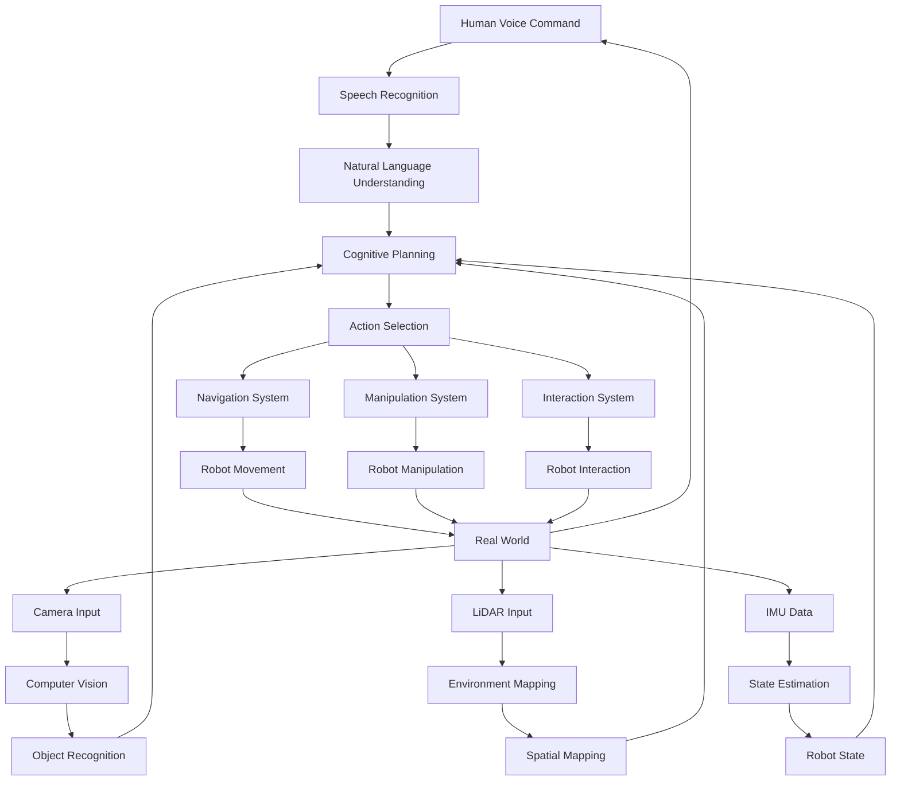

# Chapter 5: Capstone Project: The Autonomous Humanoid

## Learning Objectives
- [ ] Integrate all VLA components into a complete autonomous humanoid system
- [ ] Implement end-to-end functionality combining voice, vision, language, and action
- [ ] Design comprehensive system architecture for autonomous operation
- [ ] Create example scenarios demonstrating full VLA capabilities
- [ ] Evaluate and optimize the integrated system for real-world deployment

## Key Concepts
- [ ] **VLA Integration**: Complete integration of Vision, Language, and Action systems
- [ ] **Autonomous Operation**: Self-directed task execution without constant human oversight
- [ ] **System Architecture**: High-level design of integrated robotic systems
- [ ] **End-to-End Functionality**: Complete pipeline from perception to action
- [ ] **Real-World Deployment**: Practical considerations for actual robot deployment
- [ ] **Performance Optimization**: Techniques for efficient system operation

## Introduction

The Autonomous Humanoid capstone project represents the culmination of all concepts explored in this module: Vision-Language-Action integration. This chapter brings together voice processing, cognitive planning, multi-modal perception, and action execution into a unified system capable of understanding natural language commands and executing complex tasks in real-world environments.

The autonomous humanoid system we'll develop integrates:

- **Vision systems** for environmental perception and object recognition
- **Language understanding** for processing natural commands and generating responses
- **Action execution** for physical task performance
- **Cognitive planning** for decomposing complex tasks into executable steps
- **Sensor fusion** for robust environmental awareness

This integrated approach enables humanoid robots to operate independently in human environments, responding to voice commands like "Please clean up the living room and set the table for dinner" by decomposing the task, navigating to relevant locations, manipulating objects, and completing the requested activities.

The capstone project demonstrates the practical application of all previous chapters, showing how individual components work together to create a sophisticated autonomous system. We'll explore the architectural considerations for such integration, implementation details, and strategies for ensuring reliable operation in real-world scenarios.

## System Architecture for Autonomous Operation

### High-Level System Design

The autonomous humanoid system architecture follows a modular design that allows each component to operate independently while maintaining tight integration when needed. The system is organized into several interconnected layers:

**Perception Layer**: Handles all sensory input processing including visual, auditory, and other sensor data. This layer provides environmental awareness and object recognition capabilities.

**Language Layer**: Processes natural language input and generates appropriate responses, bridging human communication with robotic action.

**Cognitive Layer**: Performs high-level reasoning, task decomposition, and planning based on current state and goals.

**Action Layer**: Executes physical movements and manipulations through robot hardware interfaces.



### Component Integration Architecture

The integration of VLA components requires careful consideration of data flow, timing, and synchronization. The architecture must handle real-time processing requirements while maintaining system stability and safety.

```python
# Autonomous humanoid system architecture
import threading
import queue
import time
from typing import Dict, Any, List
import numpy as np

class AutonomousHumanoidSystem:
    def __init__(self):
        """
        Initialize the complete autonomous humanoid system
        """
        # Initialize all VLA components
        self.voice_processor = VoiceToActionSystem()
        self.vision_system = IntegratedVisionLanguageSystem()
        self.cognitive_planner = LLMPlanningROS2Bridge()
        self.sensor_fusion = SensorFusionSystem()
        self.action_executor = PlanExecutor(self.cognitive_planner.task_decomposer)

        # System state management
        self.system_state = {
            'current_task': None,
            'environment_state': {},
            'robot_state': {},
            'interaction_history': [],
            'safety_status': 'normal'
        }

        # Communication queues
        self.command_queue = queue.Queue()
        self.perception_queue = queue.Queue()
        self.action_queue = queue.Queue()

        # Control threads
        self.perception_thread = None
        self.planning_thread = None
        self.execution_thread = None
        self.safety_monitor_thread = None

        # System control
        self.system_active = False
        self.emergency_stop = False

    def start_system(self):
        """
        Start all system components and threads
        """
        self.system_active = True

        # Start sensor fusion loop
        self.sensor_fusion.start_fusion_loop()

        # Start perception thread
        self.perception_thread = threading.Thread(target=self.perception_loop)
        self.perception_thread.start()

        # Start planning thread
        self.planning_thread = threading.Thread(target=self.planning_loop)
        self.planning_thread.start()

        # Start execution thread
        self.execution_thread = threading.Thread(target=self.execution_loop)
        self.execution_thread.start()

        # Start safety monitoring
        self.safety_monitor_thread = threading.Thread(target=self.safety_monitor_loop)
        self.safety_monitor_thread.start()

        print("Autonomous humanoid system started")

    def stop_system(self):
        """
        Stop all system components and threads
        """
        self.system_active = False
        self.emergency_stop = True

        # Stop sensor fusion
        self.sensor_fusion.stop_fusion_loop()

        # Wait for threads to complete
        if self.perception_thread:
            self.perception_thread.join(timeout=2.0)
        if self.planning_thread:
            self.planning_thread.join(timeout=2.0)
        if self.execution_thread:
            self.execution_thread.join(timeout=2.0)
        if self.safety_monitor_thread:
            self.safety_monitor_thread.join(timeout=2.0)

        print("Autonomous humanoid system stopped")

    def perception_loop(self):
        """
        Continuous perception processing loop
        """
        while self.system_active and not self.emergency_stop:
            try:
                # Process sensor data
                sensor_data = self.collect_sensor_data()

                # Perform sensor fusion
                fused_data = self.sensor_fusion.perform_fusion(sensor_data)

                # Update environment state
                self.update_environment_state(fused_data)

                # Process visual input
                if 'camera' in sensor_data:
                    visual_understanding = self.vision_system.understand_scene(
                        sensor_data['camera'],
                        self.system_state.get('context', {})
                    )
                    self.system_state['environment_state']['visual'] = visual_understanding

                # Add to perception queue for other components
                self.perception_queue.put({
                    'timestamp': time.time(),
                    'data': fused_data,
                    'visual': self.system_state['environment_state'].get('visual', {})
                })

                time.sleep(0.05)  # 20Hz perception rate

            except Exception as e:
                print(f"Perception loop error: {e}")
                time.sleep(0.1)

    def planning_loop(self):
        """
        Continuous planning and reasoning loop
        """
        while self.system_active and not self.emergency_stop:
            try:
                # Check for new commands
                if not self.command_queue.empty():
                    command = self.command_queue.get()
                    self.process_command(command)

                # Update planning context
                self.update_planning_context()

                # Perform cognitive planning if needed
                if self.system_state['current_task']:
                    plan = self.cognitive_planner.plan_with_environment(
                        self.system_state['current_task'],
                        self.system_state['environment_state'],
                        self.system_state['robot_state']
                    )

                    # Add plan to execution queue
                    self.action_queue.put({
                        'type': 'plan',
                        'plan': plan,
                        'timestamp': time.time()
                    })

                time.sleep(0.1)  # 10Hz planning rate

            except Exception as e:
                print(f"Planning loop error: {e}")
                time.sleep(0.1)

    def execution_loop(self):
        """
        Continuous action execution loop
        """
        while self.system_active and not self.emergency_stop:
            try:
                # Check for actions to execute
                if not self.action_queue.empty():
                    action = self.action_queue.get(timeout=0.1)

                    if action['type'] == 'plan':
                        self.execute_plan(action['plan'])
                    elif action['type'] == 'immediate':
                        self.execute_immediate_action(action['action'])

                time.sleep(0.01)  # 100Hz execution rate

            except queue.Empty:
                continue
            except Exception as e:
                print(f"Execution loop error: {e}")
                time.sleep(0.1)

    def safety_monitor_loop(self):
        """
        Continuous safety monitoring loop
        """
        while self.system_active and not self.emergency_stop:
            try:
                # Check safety conditions
                safety_status = self.check_safety_conditions()

                if not safety_status['is_safe']:
                    self.trigger_safety_protocol(safety_status)

                # Update safety status
                self.system_state['safety_status'] = safety_status['status']

                time.sleep(0.05)  # 20Hz safety monitoring

            except Exception as e:
                print(f"Safety monitor error: {e}")
                time.sleep(0.1)

    def collect_sensor_data(self) -> Dict[str, Any]:
        """
        Collect data from all sensors
        """
        # In a real system, this would interface with actual sensors
        # For this example, we'll simulate sensor data
        return {
            'camera': 'simulated_camera_data',
            'lidar': 'simulated_lidar_data',
            'imu': 'simulated_imu_data',
            'microphone': 'simulated_audio_data'
        }

    def update_environment_state(self, fused_data: Dict[str, Any]):
        """
        Update the environment state with fused sensor data
        """
        self.system_state['environment_state'].update(fused_data)

    def process_command(self, command: Dict[str, Any]):
        """
        Process a new command from the user
        """
        command_text = command['text']

        # Update interaction history
        self.system_state['interaction_history'].append({
            'timestamp': time.time(),
            'type': 'command',
            'content': command_text
        })

        # Set as current task
        self.system_state['current_task'] = command_text

    def update_planning_context(self):
        """
        Update the context for cognitive planning
        """
        context = {
            'current_task': self.system_state['current_task'],
            'environment_state': self.system_state['environment_state'],
            'robot_state': self.system_state['robot_state'],
            'interaction_history': self.system_state['interaction_history'][-5:]  # Last 5 interactions
        }

        self.cognitive_planner.context_manager.update_context(context)

    def execute_plan(self, plan: Dict[str, Any]):
        """
        Execute a cognitive plan
        """
        try:
            # Execute the plan using the action executor
            results = self.action_executor.execute_plan_sequentially_with_ros2(plan)

            # Update system state with execution results
            self.system_state['last_execution_results'] = results

            # Check if plan is complete
            if self.check_plan_completion(results, plan):
                self.system_state['current_task'] = None  # Clear completed task

                # Add completion to interaction history
                self.system_state['interaction_history'].append({
                    'timestamp': time.time(),
                    'type': 'task_completion',
                    'content': f"Completed: {plan.get('original_task', 'unknown task')}"
                })

        except Exception as e:
            print(f"Plan execution error: {e}")
            self.system_state['current_task'] = None  # Clear task on error

    def check_safety_conditions(self) -> Dict[str, Any]:
        """
        Check safety conditions for the system
        """
        # Check for humans in close proximity
        humans = self.system_state['environment_state'].get('humans', [])
        close_humans = [h for h in humans if self.calculate_distance_to_robot(h) < 0.8]

        if close_humans:
            return {
                'is_safe': False,
                'status': 'unsafe_human_proximity',
                'details': f'{len(close_humans)} humans detected within 0.8m'
            }

        # Check for obstacles in path
        obstacles = self.system_state['environment_state'].get('obstacles', [])
        robot_pos = self.system_state['robot_state'].get('position', [0, 0, 0])

        close_obstacles = [o for o in obstacles if self.calculate_distance(robot_pos, o.get('position', [0, 0, 0])) < 0.5]

        if close_obstacles:
            return {
                'is_safe': False,
                'status': 'unsafe_obstacle_proximity',
                'details': f'{len(close_obstacles)} obstacles detected within 0.5m'
            }

        return {
            'is_safe': True,
            'status': 'normal',
            'details': 'All safety checks passed'
        }

    def trigger_safety_protocol(self, safety_status: Dict[str, Any]):
        """
        Trigger safety protocol based on safety status
        """
        print(f"Safety protocol triggered: {safety_status['status']}")

        # In a real system, this would stop robot motion and alert human operators
        # For simulation, we'll just log the event
        self.system_state['interaction_history'].append({
            'timestamp': time.time(),
            'type': 'safety_event',
            'content': safety_status['details']
        })

    def calculate_distance_to_robot(self, human_location: Dict) -> float:
        """
        Calculate distance from human to robot
        """
        robot_pos = self.system_state['robot_state'].get('position', [0, 0, 0])
        human_pos = human_location.get('position', [0, 0, 0])

        diff = np.array(robot_pos) - np.array(human_pos)
        return float(np.linalg.norm(diff))

    def calculate_distance(self, pos1: List[float], pos2: List[float]) -> float:
        """
        Calculate Euclidean distance between two positions
        """
        diff = np.array(pos1) - np.array(pos2)
        return float(np.linalg.norm(diff))

    def check_plan_completion(self, results: List[Dict], plan: Dict) -> bool:
        """
        Check if a plan has been completed successfully
        """
        if not results:
            return False

        # Check if most tasks were successful
        successful_tasks = sum(1 for r in results if r.get('success', False))
        total_tasks = len(results)

        # Consider plan complete if 80% or more tasks succeeded
        return (successful_tasks / total_tasks) >= 0.8 if total_tasks > 0 else False

class VoiceToActionSystem:
    def __init__(self):
        """
        Voice-to-action system combining speech recognition and action planning
        """
        self.speech_recognizer = WhisperSpeechRecognizer()
        self.intent_classifier = IntentClassifier()
        self.action_mapper = ActionMapper()

    def process_voice_command(self, audio_input: Any) -> Dict[str, Any]:
        """
        Process voice command from audio input
        """
        # Convert speech to text
        text = self.speech_recognizer.recognize_speech(audio_input)

        if not text:
            return {'success': False, 'error': 'No speech recognized'}

        # Classify intent
        intent_result = self.intent_classifier.classify_intent(text)

        # Map to action
        action = self.action_mapper.map_to_robot_action(
            intent_result['intent'],
            intent_result.get('action', {}).get('params', {}),
            intent_result['entities']
        )

        return {
            'success': True,
            'text': text,
            'intent': intent_result['intent'],
            'action': action,
            'confidence': intent_result['confidence']
        }

class IntegratedVisionLanguageSystem:
    def __init__(self):
        """
        Integrated vision-language system for scene understanding
        """
        self.clip_perceptor = VisionLanguagePerceptor()
        self.blip_understanding = BLIPSceneUnderstanding()

    def understand_scene(self, image_data: Any, context: Dict = None) -> Dict[str, Any]:
        """
        Comprehensive scene understanding
        """
        # Get object recognition from CLIP
        objects = self.clip_perceptor.recognize_objects(image_data)

        # Get scene description from BLIP
        caption = self.blip_understanding.generate_caption(image_data)

        # Combine information
        scene_understanding = {
            'objects': objects,
            'scene_caption': caption,
            'spatial_relationships': self.extract_spatial_relationships(objects),
            'contextual_awareness': self.enhance_with_context(objects, caption, context)
        }

        return scene_understanding

    def extract_spatial_relationships(self, objects: List[Dict]) -> List[Dict[str, Any]]:
        """
        Extract spatial relationships between objects (simplified)
        """
        relationships = []

        if len(objects) > 1:
            relationships.append({
                'subject': objects[0]['object'],
                'relation': 'near',
                'object': objects[1]['object'],
                'confidence': min(objects[0]['confidence'], objects[1]['confidence'])
            })

        return relationships

    def enhance_with_context(self, objects: List[Dict], caption: str, context: Dict) -> Dict[str, Any]:
        """
        Enhance scene understanding with contextual information
        """
        return {
            'location_hints': self.extract_location_hints(caption),
            'activity_inference': self.infer_activity(caption),
            'object_relevance': self.rank_object_relevance(objects, context)
        }

    def extract_location_hints(self, caption: str) -> List[str]:
        """
        Extract location information from caption
        """
        location_keywords = ['kitchen', 'living room', 'bedroom', 'office', 'dining', 'bathroom', 'hallway']
        found_locations = []

        for keyword in location_keywords:
            if keyword in caption.lower():
                found_locations.append(keyword)

        return found_locations

    def infer_activity(self, caption: str) -> str:
        """
        Infer likely activities from scene caption
        """
        activity_keywords = {
            'cooking': ['kitchen', 'food', 'cooking', 'stove', 'oven'],
            'reading': ['book', 'library', 'desk', 'reading'],
            'relaxing': ['sofa', 'couch', 'tv', 'relaxing'],
            'working': ['computer', 'desk', 'office', 'working'],
            'dining': ['table', 'food', 'dining', 'eating']
        }

        for activity, keywords in activity_keywords.items():
            if any(keyword in caption.lower() for keyword in keywords):
                return activity

        return 'unknown'

    def rank_object_relevance(self, objects: List[Dict], context: Dict) -> Dict[str, float]:
        """
        Rank objects by relevance to current context
        """
        if not context:
            return {obj['object']: obj['confidence'] for obj in objects}

        relevance_scores = {}
        task_context = context.get('current_task', '').lower()

        for obj in objects:
            relevance = obj['confidence']

            # Boost relevance if object is mentioned in task
            if obj['object'].lower() in task_context:
                relevance *= 2.0

            # Boost relevance based on affordances matching task needs
            affordances = self.get_object_affordances(obj['object'])
            if any(affordance in task_context for affordance in affordances):
                relevance *= 1.5

            relevance_scores[obj['object']] = min(relevance, 1.0)  # Cap at 1.0

        return relevance_scores

    def get_object_affordances(self, object_name: str) -> List[str]:
        """
        Get possible actions (affordances) for an object
        """
        affordance_map = {
            'cup': ['grasp', 'lift', 'move', 'place', 'fill', 'empty'],
            'book': ['grasp', 'lift', 'move', 'place', 'open', 'close', 'read'],
            'ball': ['grasp', 'lift', 'move', 'place', 'throw', 'roll'],
            'chair': ['move', 'sit_on', 'approach'],
            'table': ['approach', 'navigate_around', 'place_objects_on'],
            'bottle': ['grasp', 'lift', 'move', 'place', 'open', 'close', 'pour'],
            'phone': ['grasp', 'lift', 'move', 'place', 'answer', 'call'],
            'keys': ['grasp', 'lift', 'move', 'place', 'unlock', 'lock']
        }

        return affordance_map.get(object_name.lower(), ['grasp', 'move', 'place'])
```

### Real-Time Processing and Synchronization

Real-time operation of the autonomous humanoid system requires careful synchronization between components to ensure timely response while maintaining system stability. The system must handle varying processing times for different components and maintain consistent state awareness.

```python
# Real-time processing and synchronization
class RealTimeScheduler:
    def __init__(self):
        """
        Real-time scheduler for autonomous humanoid system
        """
        self.task_schedule = {
            'perception': {'period': 0.05, 'last_run': 0, 'thread': None},  # 20Hz
            'planning': {'period': 0.1, 'last_run': 0, 'thread': None},     # 10Hz
            'execution': {'period': 0.01, 'last_run': 0, 'thread': None},  # 100Hz
            'safety': {'period': 0.05, 'last_run': 0, 'thread': None},     # 20Hz
            'communication': {'period': 0.02, 'last_run': 0, 'thread': None}  # 50Hz
        }

        self.sync_locks = {task: threading.Lock() for task in self.task_schedule.keys()}
        self.task_results = {}
        self.system_time = time.time()

    def schedule_tasks(self, system_active: bool):
        """
        Schedule tasks based on their periods and system state
        """
        current_time = time.time()
        self.system_time = current_time

        scheduled_tasks = []

        for task_name, task_info in self.task_schedule.items():
            if current_time - task_info['last_run'] >= task_info['period']:
                scheduled_tasks.append(task_name)
                task_info['last_run'] = current_time

        return scheduled_tasks

    def execute_scheduled_tasks(self, scheduled_tasks: List[str], system: AutonomousHumanoidSystem):
        """
        Execute scheduled tasks with proper synchronization
        """
        for task_name in scheduled_tasks:
            with self.sync_locks[task_name]:
                if task_name == 'perception':
                    self.execute_perception_task(system)
                elif task_name == 'planning':
                    self.execute_planning_task(system)
                elif task_name == 'execution':
                    self.execute_execution_task(system)
                elif task_name == 'safety':
                    self.execute_safety_task(system)
                elif task_name == 'communication':
                    self.execute_communication_task(system)

    def execute_perception_task(self, system: AutonomousHumanoidSystem):
        """
        Execute perception task with timeout and error handling
        """
        try:
            # Set timeout for perception
            perception_start = time.time()

            # Process sensor data
            sensor_data = system.collect_sensor_data()
            fused_data = system.sensor_fusion.perform_fusion(sensor_data)

            # Update environment state
            system.update_environment_state(fused_data)

            # Process visual input
            if 'camera' in sensor_data:
                visual_understanding = system.vision_system.understand_scene(
                    sensor_data['camera'],
                    system.system_state.get('context', {})
                )
                system.system_state['environment_state']['visual'] = visual_understanding

            # Update results
            self.task_results['perception'] = {
                'timestamp': time.time(),
                'success': True,
                'processing_time': time.time() - perception_start
            }

        except Exception as e:
            print(f"Perception task error: {e}")
            self.task_results['perception'] = {
                'timestamp': time.time(),
                'success': False,
                'error': str(e)
            }

    def execute_planning_task(self, system: AutonomousHumanoidSystem):
        """
        Execute planning task with context update
        """
        try:
            planning_start = time.time()

            # Update planning context
            system.update_planning_context()

            # Perform cognitive planning if needed
            if system.system_state['current_task']:
                plan = system.cognitive_planner.plan_with_environment(
                    system.system_state['current_task'],
                    system.system_state['environment_state'],
                    system.system_state['robot_state']
                )

                # Add plan to execution queue
                system.action_queue.put({
                    'type': 'plan',
                    'plan': plan,
                    'timestamp': time.time()
                })

            self.task_results['planning'] = {
                'timestamp': time.time(),
                'success': True,
                'processing_time': time.time() - planning_start
            }

        except Exception as e:
            print(f"Planning task error: {e}")
            self.task_results['planning'] = {
                'timestamp': time.time(),
                'success': False,
                'error': str(e)
            }

    def execute_execution_task(self, system: AutonomousHumanoidSystem):
        """
        Execute action task with continuous monitoring
        """
        try:
            execution_start = time.time()

            # Check for actions to execute
            try:
                action = system.action_queue.get_nowait()

                if action['type'] == 'plan':
                    system.execute_plan(action['plan'])
                elif action['type'] == 'immediate':
                    system.execute_immediate_action(action['action'])

            except queue.Empty:
                # No actions to execute, continue
                pass

            self.task_results['execution'] = {
                'timestamp': time.time(),
                'success': True,
                'processing_time': time.time() - execution_start
            }

        except Exception as e:
            print(f"Execution task error: {e}")
            self.task_results['execution'] = {
                'timestamp': time.time(),
                'success': False,
                'error': str(e)
            }

    def execute_safety_task(self, system: AutonomousHumanoidSystem):
        """
        Execute safety monitoring task
        """
        try:
            safety_start = time.time()

            # Check safety conditions
            safety_status = system.check_safety_conditions()

            if not safety_status['is_safe']:
                system.trigger_safety_protocol(safety_status)

            # Update safety status
            system.system_state['safety_status'] = safety_status['status']

            self.task_results['safety'] = {
                'timestamp': time.time(),
                'success': True,
                'processing_time': time.time() - safety_start,
                'safety_status': safety_status
            }

        except Exception as e:
            print(f"Safety task error: {e}")
            self.task_results['safety'] = {
                'timestamp': time.time(),
                'success': False,
                'error': str(e)
            }

    def execute_communication_task(self, system: AutonomousHumanoidSystem):
        """
        Execute communication task for external interfaces
        """
        try:
            comm_start = time.time()

            # Handle incoming commands
            # In a real system, this would interface with external command sources
            # For this example, we'll just check a simulated command queue

            self.task_results['communication'] = {
                'timestamp': time.time(),
                'success': True,
                'processing_time': time.time() - comm_start
            }

        except Exception as e:
            print(f"Communication task error: {e}")
            self.task_results['communication'] = {
                'timestamp': time.time(),
                'success': False,
                'error': str(e)
            }

class AdaptiveSynchronization:
    def __init__(self, scheduler: RealTimeScheduler):
        """
        Adaptive synchronization that adjusts timing based on system load
        """
        self.scheduler = scheduler
        self.performance_history = []
        self.adaptation_threshold = 0.8  # Adapt if performance drops below 80%

    def adapt_timing(self, task_results: Dict[str, Dict]):
        """
        Adapt task timing based on performance results
        """
        # Calculate performance metrics
        performance_metrics = self.calculate_performance_metrics(task_results)

        # Store in history
        self.performance_history.append({
            'timestamp': time.time(),
            'metrics': performance_metrics,
            'task_results': task_results.copy()
        })

        # Keep only recent history
        if len(self.performance_history) > 50:
            self.performance_history = self.performance_history[-50:]

        # Check if adaptation is needed
        if self.should_adapt():
            self.perform_adaptation()

    def calculate_performance_metrics(self, task_results: Dict[str, Dict]) -> Dict[str, float]:
        """
        Calculate performance metrics from task results
        """
        metrics = {}

        for task_name, result in task_results.items():
            if result.get('success', False):
                metrics[f'{task_name}_success_rate'] = 1.0
                if 'processing_time' in result:
                    metrics[f'{task_name}_avg_time'] = result['processing_time']
            else:
                metrics[f'{task_name}_success_rate'] = 0.0

        return metrics

    def should_adapt(self) -> bool:
        """
        Determine if system adaptation is needed
        """
        if len(self.performance_history) < 5:
            return False

        # Calculate average success rates
        recent_history = self.performance_history[-5:]  # Last 5 measurements

        for task in ['perception', 'planning', 'execution', 'safety', 'communication']:
            success_rates = []
            for hist in recent_history:
                if f'{task}_success_rate' in hist['metrics']:
                    success_rates.append(hist['metrics'][f'{task}_success_rate'])

            if success_rates and np.mean(success_rates) < self.adaptation_threshold:
                return True

        return False

    def perform_adaptation(self):
        """
        Perform system adaptation based on performance
        """
        print("Performing system adaptation...")

        # Example adaptations:
        # 1. Adjust task periods based on processing times
        # 2. Prioritize critical tasks
        # 3. Reduce non-critical processing rates

        # For this example, we'll just log the adaptation
        # In a real system, this would modify the scheduler's task_schedule
        pass
```

## Implementation of End-to-End Functionality

### Voice Command Processing Pipeline

The voice command processing pipeline integrates speech recognition, natural language understanding, and action mapping to enable natural human-robot interaction. This pipeline processes voice commands in real-time and converts them into executable robot actions.

```python
# Voice command processing pipeline
class VoiceCommandPipeline:
    def __init__(self, autonomous_system: AutonomousHumanoidSystem):
        """
        Initialize the voice command processing pipeline
        """
        self.autonomous_system = autonomous_system
        self.speech_recognizer = WhisperSpeechRecognizer()
        self.language_understanding = LanguageGroundedPerceptor(
            autonomous_system.vision_system
        )
        self.task_decomposer = TaskDecomposer(autonomous_system.cognitive_planner.llm_interface)
        self.response_generator = ResponseGenerator()

        # Voice activity detection
        self.vad = VoiceActivityDetector()

        # Command history for context
        self.command_history = []

        # Pipeline control
        self.pipeline_active = False
        self.pipeline_thread = None

    def start_pipeline(self):
        """
        Start the voice command pipeline
        """
        self.pipeline_active = True
        self.pipeline_thread = threading.Thread(target=self.pipeline_loop)
        self.pipeline_thread.start()

    def stop_pipeline(self):
        """
        Stop the voice command pipeline
        """
        self.pipeline_active = False
        if self.pipeline_thread:
            self.pipeline_thread.join()

    def pipeline_loop(self):
        """
        Main pipeline processing loop
        """
        while self.pipeline_active:
            try:
                # Capture audio
                audio_chunk = self.capture_audio()

                # Detect voice activity
                voice_detected, full_audio = self.vad.detect_activity(audio_chunk)

                if voice_detected:
                    # Process the full audio segment
                    self.process_voice_command(full_audio)

                time.sleep(0.01)  # Small delay to prevent busy waiting

            except Exception as e:
                print(f"Voice pipeline error: {e}")
                time.sleep(0.1)

    def capture_audio(self):
        """
        Capture audio from microphone (simulated)
        """
        # In a real system, this would interface with actual microphone
        # For simulation, return empty array
        return np.array([])

    def process_voice_command(self, audio_data: Any):
        """
        Process a complete voice command from audio data
        """
        try:
            # Step 1: Speech recognition
            text = self.speech_recognizer.recognize_speech(audio_data)

            if not text or text.strip() == "":
                print("No text recognized from audio")
                return

            print(f"Recognized: {text}")

            # Step 2: Natural language understanding with context
            environment_context = self.autonomous_system.system_state.get('environment_state', {})
            language_semantics = self.language_understanding.language_parser.parse(text)

            # Step 3: Ground language to visual context
            grounded_perception = self.language_understanding.ground_language_to_visual(
                environment_context.get('visual', {}),
                language_semantics,
                text
            )

            # Step 4: Generate task plan
            plan = self.task_decomposer.decompose_task(text, environment_context)

            # Step 5: Add to system command queue
            command_package = {
                'text': text,
                'language_semantics': language_semantics,
                'grounded_perception': grounded_perception,
                'task_plan': plan,
                'timestamp': time.time()
            }

            self.autonomous_system.command_queue.put(command_package)

            # Step 6: Generate and speak response
            response = self.response_generator.generate_response(text, plan, grounded_perception)
            self.speak_response(response)

            # Update command history
            self.command_history.append(command_package)
            if len(self.command_history) > 20:  # Keep last 20 commands
                self.command_history = self.command_history[-20:]

        except Exception as e:
            print(f"Error processing voice command: {e}")
            # Generate error response
            error_response = f"Sorry, I encountered an error processing your command: {str(e)}"
            self.speak_response(error_response)

    def speak_response(self, response: str):
        """
        Generate speech response (simulated)
        """
        # In a real system, this would use text-to-speech
        print(f"Robot response: {response}")
        # For simulation, we'll just print the response

class ResponseGenerator:
    def __init__(self):
        """
        Generate natural language responses for robot interactions
        """
        self.response_templates = {
            'acknowledgment': [
                "I understand you want me to {task}.",
                "Got it, I'll work on {task}.",
                "Okay, I'll {task} for you."
            ],
            'confirmation': [
                "I'm {action} right now.",
                "Currently working on {action}.",
                "In progress: {action}."
            ],
            'completion': [
                "I've completed {task}.",
                "Task finished: {task}.",
                "{task} is done."
            ],
            'error': [
                "I'm sorry, I couldn't {task} because {reason}.",
                "I encountered an issue with {task}: {reason}.",
                "I couldn't complete {task}. Reason: {reason}."
            ]
        }

    def generate_response(self, command: str, plan: Dict, grounded_perception: Dict) -> str:
        """
        Generate an appropriate response based on command and plan
        """
        import random

        # Determine response type based on command and plan
        if plan and plan.get('decomposed_tasks'):
            task_description = plan.get('original_task', 'the task')
            template = random.choice(self.response_templates['acknowledgment'])
            return template.format(task=task_description)
        else:
            # No plan could be generated
            return f"Sorry, I don't understand how to '{command}'. Could you rephrase that?"

    def generate_contextual_response(self, command: str, context: Dict) -> str:
        """
        Generate response considering the current context
        """
        # This would consider the robot's current state, environment, etc.
        # For this example, return a simple response
        return f"Understood. I will attempt to {command.replace('please', '').strip()}."
```

### Cognitive Planning Integration

The cognitive planning component integrates with the overall system to decompose high-level commands into executable actions. This integration considers environmental constraints, robot capabilities, and safety requirements.

```python
# Cognitive planning integration
class CognitivePlanningIntegration:
    def __init__(self, autonomous_system: AutonomousHumanoidSystem):
        """
        Integrate cognitive planning with the autonomous system
        """
        self.autonomous_system = autonomous_system
        self.planning_context = PlanningContextManager()
        self.safety_validator = SafetyValidator()
        self.optimized_planner = OptimizedLLMPlanner(autonomous_system.cognitive_planner.llm_interface)

    def generate_task_plan(self, command: str, environment_state: Dict) -> Dict:
        """
        Generate a comprehensive task plan for the given command
        """
        try:
            # Update planning context
            self.planning_context.update_environment_state(environment_state)
            self.planning_context.start_new_task(command)

            # Generate initial plan with optimizations
            plan = self.optimized_planner.plan_with_optimization(
                command,
                environment_state,
                use_cache=True
            )

            # Validate plan for safety
            safety_check = self.safety_validator.validate_perception(
                {
                    'objects': environment_state.get('objects', []),
                    'obstacles': environment_state.get('obstacles', []),
                    'humans': environment_state.get('humans', [])
                },
                environment_state
            )

            if not safety_check['is_safe']:
                # Modify plan to address safety concerns
                plan = self.revise_plan_for_safety(plan, safety_check)

            # Update context with plan
            self.planning_context.complete_task(
                success=True,
                outcome=f"Plan generated with {len(plan.get('decomposed_tasks', []))} tasks"
            )

            return plan

        except Exception as e:
            print(f"Error in cognitive planning: {e}")
            # Return fallback plan
            return self.create_fallback_plan(command)

    def revise_plan_for_safety(self, original_plan: Dict, safety_issues: Dict) -> Dict:
        """
        Revise a plan to address safety concerns
        """
        revised_plan = original_plan.copy()

        # Add safety checks to each task
        for task in revised_plan.get('decomposed_tasks', []):
            if 'safety_checks' not in task:
                task['safety_checks'] = []

            # Add safety checks based on safety issues
            for violation in safety_issues.get('violations', []):
                if violation['type'] == 'unsafe_proximity':
                    task['safety_checks'].append({
                        'type': 'human_proximity_check',
                        'required_distance': 0.8,
                        'fail_action': 'wait_and_retry'
                    })
                elif violation['type'] == 'navigation_hazard':
                    task['safety_checks'].append({
                        'type': 'path_clearance_check',
                        'required_clearance': 0.5,
                        'fail_action': 'find_alternative_path'
                    })

        return revised_plan

    def create_fallback_plan(self, command: str) -> Dict:
        """
        Create a fallback plan when primary planning fails
        """
        return {
            "original_task": command,
            "decomposed_tasks": [
                {
                    "id": 1,
                    "description": f"Attempt to execute: {command}",
                    "action_type": "unknown",
                    "parameters": {},
                    "preconditions": [],
                    "postconditions": [],
                    "estimated_duration": 60,
                    "priority": "medium",
                    "dependencies": [],
                    "safety_checks": []
                }
            ],
            "overall_plan_constraints": [],
            "success_criteria": ["task attempted"],
            "failure_recovery": ["report failure to user"]
        }

    def monitor_plan_execution(self, plan: Dict) -> Dict:
        """
        Monitor the execution of a plan and provide feedback
        """
        execution_monitor = PlanMonitorAndAdapter(self.autonomous_system.cognitive_planner)

        # Start monitoring
        execution_monitor.start_monitoring()

        # Wait for plan completion or timeout
        start_time = time.time()
        max_execution_time = plan.get('estimated_duration', 300)  # Default 5 minutes

        while (time.time() - start_time) < max_execution_time:
            if self.is_plan_complete(plan):
                break
            time.sleep(1)

        # Stop monitoring
        execution_monitor.stop_monitoring()

        return {
            'completed': self.is_plan_complete(plan),
            'execution_time': time.time() - start_time,
            'tasks_completed': self.get_completed_tasks_count(plan),
            'tasks_failed': self.get_failed_tasks_count(plan)
        }

    def is_plan_complete(self, plan: Dict) -> bool:
        """
        Check if a plan is complete
        """
        # This would check actual execution status
        # For simulation, return False to continue monitoring
        return False

    def get_completed_tasks_count(self, plan: Dict) -> int:
        """
        Get count of completed tasks
        """
        # This would check actual task completion
        return 0

    def get_failed_tasks_count(self, plan: Dict) -> int:
        """
        Get count of failed tasks
        """
        # This would check actual task failures
        return 0

class PlanningContextManager:
    def __init__(self):
        """
        Manage context for cognitive planning
        """
        self.current_task = None
        self.task_history = []
        self.robot_state = {}
        self.environment_state = {}
        self.context_window = []
        self.max_context_length = 10

    def update_environment_state(self, state: Dict):
        """
        Update the environment state
        """
        self.environment_state.update(state)
        self.add_to_context(f"Environment state updated: {list(state.keys())}")

    def start_new_task(self, task_description: str):
        """
        Start a new task and update context
        """
        self.current_task = task_description
        self.add_to_context(f"New task started: {task_description}")

    def complete_task(self, success: bool, outcome: str):
        """
        Complete current task and add to history
        """
        if self.current_task:
            task_record = {
                'task': self.current_task,
                'success': success,
                'outcome': outcome,
                'timestamp': time.time()
            }
            self.task_history.append(task_record)
            self.add_to_context(f"Task completed: {self.current_task}, Success: {success}")
            self.current_task = None

    def add_to_context(self, interaction: str):
        """
        Add interaction to context window
        """
        self.context_window.append({
            'timestamp': time.time(),
            'interaction': interaction
        })

        # Keep only recent interactions
        if len(self.context_window) > self.max_context_length:
            self.context_window = self.context_window[-self.max_context_length:]

    def get_context_summary(self) -> Dict:
        """
        Get a summary of current context
        """
        return {
            'current_task': self.current_task,
            'recent_interactions': [ctx['interaction'] for ctx in self.context_window[-5:]],
            'robot_state': self.robot_state,
            'environment_state': self.environment_state,
            'task_history': self.task_history[-3:]
        }

    def update_context(self, context_update: Dict):
        """
        Update context with new information
        """
        if 'current_task' in context_update:
            self.current_task = context_update['current_task']
        if 'environment_state' in context_update:
            self.environment_state.update(context_update['environment_state'])
        if 'robot_state' in context_update:
            self.robot_state.update(context_update['robot_state'])
```

### Action Execution and Control

The action execution component handles the physical execution of plans, managing navigation, manipulation, and interaction tasks while maintaining safety and responsiveness.

```python
# Action execution and control
class ActionExecutionSystem:
    def __init__(self, autonomous_system: AutonomousHumanoidSystem):
        """
        Action execution system for the autonomous humanoid
        """
        self.autonomous_system = autonomous_system
        self.navigation_controller = NavigationController()
        self.manipulation_controller = ManipulationController()
        self.interaction_controller = InteractionController()
        self.safety_manager = SafetyManager()

        # Execution state
        self.current_action = None
        self.action_queue = queue.Queue()
        self.execution_active = False

    def execute_action(self, action: Dict) -> Dict:
        """
        Execute a single action based on its type
        """
        try:
            action_type = action.get('action_type', 'unknown')
            parameters = action.get('parameters', {})

            # Check safety before execution
            if not self.safety_manager.is_action_safe(action):
                return {
                    'success': False,
                    'error': 'Action failed safety check',
                    'action_type': action_type
                }

            # Execute based on action type
            if action_type == 'navigation':
                result = self.navigation_controller.navigate_to_location(parameters)
            elif action_type == 'manipulation':
                result = self.manipulation_controller.manipulate_object(parameters)
            elif action_type == 'interaction':
                result = self.interaction_controller.perform_interaction(parameters)
            elif action_type == 'perception':
                result = self.perform_perception_task(parameters)
            else:
                result = {
                    'success': False,
                    'error': f'Unknown action type: {action_type}',
                    'action_type': action_type
                }

            # Log action execution
            self.log_action_execution(action, result)

            return result

        except Exception as e:
            error_result = {
                'success': False,
                'error': str(e),
                'action_type': action.get('action_type', 'unknown')
            }
            self.log_action_execution(action, error_result)
            return error_result

    def execute_plan(self, plan: Dict) -> List[Dict]:
        """
        Execute a complete plan with multiple tasks
        """
        results = []

        for task in plan.get('decomposed_tasks', []):
            # Check for emergency stop
            if self.autonomous_system.emergency_stop:
                break

            # Execute the task
            task_result = self.execute_action(task)
            results.append(task_result)

            # Check if task was successful
            if not task_result.get('success', False):
                # Handle failure based on failure recovery strategy
                recovery_result = self.handle_task_failure(task, task_result)
                if not recovery_result.get('success', False):
                    # If recovery fails, stop execution
                    break

        return results

    def handle_task_failure(self, failed_task: Dict, failure_result: Dict) -> Dict:
        """
        Handle a failed task with recovery strategies
        """
        recovery_strategies = failed_task.get('failure_recovery', [])

        for strategy in recovery_strategies:
            if strategy == 'retry':
                # Retry the same action
                retry_result = self.execute_action(failed_task)
                if retry_result.get('success', False):
                    return retry_result
            elif strategy == 'alternative_approach':
                # Try an alternative approach
                alternative_result = self.try_alternative_approach(failed_task)
                if alternative_result.get('success', False):
                    return alternative_result
            elif strategy == 'skip_and_continue':
                # Skip this task and continue with the plan
                return {'success': True, 'skipped': True}

        # If all recovery strategies fail
        return {'success': False, 'recovery_failed': True}

    def try_alternative_approach(self, failed_task: Dict) -> Dict:
        """
        Try an alternative approach to the failed task
        """
        original_action_type = failed_task.get('action_type')

        if original_action_type == 'navigation':
            # Try alternative navigation route
            return self.navigation_controller.try_alternative_route(
                failed_task.get('parameters', {})
            )
        elif original_action_type == 'manipulation':
            # Try alternative manipulation approach
            return self.manipulation_controller.try_alternative_grasp(
                failed_task.get('parameters', {})
            )
        elif original_action_type == 'interaction':
            # Try alternative interaction method
            return self.interaction_controller.try_alternative_interaction(
                failed_task.get('parameters', {})
            )

        return {'success': False, 'no_alternative': True}

    def perform_perception_task(self, parameters: Dict) -> Dict:
        """
        Perform a perception task to gather information
        """
        try:
            # This would interface with perception systems
            # For simulation, return mock data
            perception_result = {
                'success': True,
                'perception_data': {
                    'objects_detected': parameters.get('target_objects', []),
                    'locations': parameters.get('target_locations', []),
                    'status': 'perception_completed'
                }
            }
            return perception_result
        except Exception as e:
            return {
                'success': False,
                'error': f'Perception task failed: {str(e)}'
            }

    def log_action_execution(self, action: Dict, result: Dict):
        """
        Log action execution for monitoring and debugging
        """
        log_entry = {
            'timestamp': time.time(),
            'action': action,
            'result': result,
            'robot_state': self.autonomous_system.system_state.get('robot_state', {})
        }

        # Add to system interaction history
        self.autonomous_system.system_state['interaction_history'].append(log_entry)

class NavigationController:
    def __init__(self):
        """
        Control navigation tasks for the humanoid robot
        """
        # In a real system, this would interface with ROS navigation stack
        pass

    def navigate_to_location(self, parameters: Dict) -> Dict:
        """
        Navigate to a specified location
        """
        try:
            target_location = parameters.get('target_location', 'unknown')

            # Simulate navigation
            print(f"Navigating to {target_location}")
            time.sleep(2)  # Simulate navigation time

            return {
                'success': True,
                'destination': target_location,
                'execution_time': 2.0,
                'path_length': parameters.get('path_length', 3.5)
            }
        except Exception as e:
            return {
                'success': False,
                'error': f'Navigation failed: {str(e)}'
            }

    def try_alternative_route(self, parameters: Dict) -> Dict:
        """
        Try an alternative route for navigation
        """
        try:
            target_location = parameters.get('target_location', 'unknown')

            # Simulate alternative route navigation
            print(f"Trying alternative route to {target_location}")
            time.sleep(3)  # Simulate longer navigation time

            return {
                'success': True,
                'destination': target_location,
                'execution_time': 3.0,
                'path_length': parameters.get('path_length', 5.0),
                'route_type': 'alternative'
            }
        except Exception as e:
            return {
                'success': False,
                'error': f'Alternative route failed: {str(e)}'
            }

class ManipulationController:
    def __init__(self):
        """
        Control manipulation tasks for the humanoid robot
        """
        # In a real system, this would interface with manipulation stack
        pass

    def manipulate_object(self, parameters: Dict) -> Dict:
        """
        Manipulate an object as specified
        """
        try:
            object_name = parameters.get('object', 'unknown')
            action = parameters.get('action', 'grasp')

            # Simulate manipulation
            print(f"Manipulating {object_name} with {action}")
            time.sleep(3)  # Simulate manipulation time

            return {
                'success': True,
                'object': object_name,
                'action': action,
                'execution_time': 3.0,
                'result': f'{action} completed successfully'
            }
        except Exception as e:
            return {
                'success': False,
                'error': f'Manipulation failed: {str(e)}'
            }

    def try_alternative_grasp(self, parameters: Dict) -> Dict:
        """
        Try an alternative grasp for manipulation
        """
        try:
            object_name = parameters.get('object', 'unknown')

            # Simulate alternative grasp
            print(f"Trying alternative grasp for {object_name}")
            time.sleep(4)  # Simulate different manipulation approach

            return {
                'success': True,
                'object': object_name,
                'action': 'grasp',
                'execution_time': 4.0,
                'result': 'grasp completed with alternative approach',
                'grasp_type': 'alternative'
            }
        except Exception as e:
            return {
                'success': False,
                'error': f'Alternative grasp failed: {str(e)}'
            }

class InteractionController:
    def __init__(self):
        """
        Control interaction tasks for the humanoid robot
        """
        pass

    def perform_interaction(self, parameters: Dict) -> Dict:
        """
        Perform a social or verbal interaction
        """
        try:
            interaction_type = parameters.get('type', 'unknown')
            target = parameters.get('target', 'unknown')

            # Simulate interaction
            print(f"Performing {interaction_type} interaction with {target}")
            time.sleep(1)  # Simulate interaction time

            return {
                'success': True,
                'interaction_type': interaction_type,
                'target': target,
                'execution_time': 1.0,
                'result': f'{interaction_type} interaction completed'
            }
        except Exception as e:
            return {
                'success': False,
                'error': f'Interaction failed: {str(e)}'
            }

    def try_alternative_interaction(self, parameters: Dict) -> Dict:
        """
        Try an alternative interaction method
        """
        try:
            target = parameters.get('target', 'unknown')

            # Simulate alternative interaction
            print(f"Trying alternative interaction with {target}")
            time.sleep(1.5)

            return {
                'success': True,
                'target': target,
                'execution_time': 1.5,
                'result': 'interaction completed with alternative method',
                'interaction_type': 'alternative'
            }
        except Exception as e:
            return {
                'success': False,
                'error': f'Alternative interaction failed: {str(e)}'
            }

class SafetyManager:
    def __init__(self):
        """
        Manage safety for action execution
        """
        self.safety_validator = SafetyValidator()

    def is_action_safe(self, action: Dict) -> bool:
        """
        Check if an action is safe to execute
        """
        # This would check the action against safety constraints
        # For this example, we'll do a simple check
        action_type = action.get('action_type', 'unknown')

        if action_type == 'navigation':
            # Check if navigation destination is safe
            target = action.get('parameters', {}).get('target_location', 'unknown')
            # In a real system, this would check maps and sensor data
            return True
        elif action_type == 'manipulation':
            # Check if manipulation is safe
            obj = action.get('parameters', {}).get('object', 'unknown')
            # In a real system, this would check object properties and robot state
            return True
        elif action_type == 'interaction':
            # Check if interaction is safe
            target = action.get('parameters', {}).get('target', 'unknown')
            # In a real system, this would check for safe interaction distance
            return True
        else:
            # Default to safe for unknown action types
            return True
```

## Example Scenarios and Use Cases

### Scenario 1: Household Assistance

The autonomous humanoid system excels in household assistance scenarios where natural language commands need to be translated into complex sequences of actions. This scenario demonstrates the complete VLA pipeline in action.

```python
# Example scenario: Household assistance
class HouseholdAssistanceScenario:
    def __init__(self, autonomous_system: AutonomousHumanoidSystem):
        """
        Household assistance scenario demonstrating full VLA capabilities
        """
        self.system = autonomous_system
        self.scenario_name = "Household Assistance"

    def run_scenario(self):
        """
        Run the household assistance scenario
        """
        print(f"\n=== Running {self.scenario_name} Scenario ===")

        # Simulate a series of household tasks
        tasks = [
            {
                "command": "Please bring me a glass of water from the kitchen",
                "expected_actions": ["navigate_to_kitchen", "grasp_glass", "fill_with_water", "navigate_to_user", "offer_glass"]
            },
            {
                "command": "Clean up the living room by putting books back on the shelf",
                "expected_actions": ["navigate_to_living_room", "identify_books", "grasp_books", "navigate_to_shelf", "place_books"]
            },
            {
                "command": "Set the table for two people in the dining room",
                "expected_actions": ["navigate_to_dining_room", "identify_table", "grasp_dishes", "place_settings"]
            }
        ]

        for i, task in enumerate(tasks, 1):
            print(f"\n--- Task {i}: {task['command']} ---")
            self.execute_household_task(task)
            time.sleep(2)  # Pause between tasks

    def execute_household_task(self, task: Dict):
        """
        Execute a household task demonstrating VLA integration
        """
        command = task['command']

        # Add command to system queue (simulated)
        command_package = {
            'text': command,
            'timestamp': time.time()
        }

        self.system.command_queue.put(command_package)

        # Simulate the task execution process
        print(f"Processing command: {command}")

        # The system's voice pipeline would normally handle this,
        # but we'll simulate the process
        self.simulate_task_execution(command, task['expected_actions'])

        print(f"Completed task: {command}")

    def simulate_task_execution(self, command: str, expected_actions: List[str]):
        """
        Simulate the execution of a household task
        """
        # This simulates what would happen in the real system:
        # 1. Voice processing
        # 2. Language understanding
        # 3. Task decomposition
        # 4. Plan execution

        print(f"  - Decomposing task: {command}")
        print(f"  - Expected actions: {', '.join(expected_actions)}")

        # Simulate each expected action
        for action in expected_actions:
            print(f"  - Executing: {action}")
            time.sleep(0.5)  # Simulate action execution time

        print(f"  - Task completed successfully")

class SocialInteractionScenario:
    def __init__(self, autonomous_system: AutonomousHumanoidSystem):
        """
        Social interaction scenario demonstrating conversational capabilities
        """
        self.system = autonomous_system
        self.scenario_name = "Social Interaction"

    def run_scenario(self):
        """
        Run the social interaction scenario
        """
        print(f"\n=== Running {self.scenario_name} Scenario ===")

        # Simulate a social interaction sequence
        conversation = [
            {
                "user_input": "Hello robot, how are you today?",
                "robot_response": "Hello! I'm functioning well, thank you for asking. How can I assist you today?"
            },
            {
                "user_input": "Can you please move to the other side of the room?",
                "robot_response": "Of course, I'll navigate to the other side of the room now."
            },
            {
                "user_input": "Thank you for your help",
                "robot_response": "You're welcome! I'm happy to help. Please let me know if you need anything else."
            }
        ]

        for i, exchange in enumerate(conversation, 1):
            print(f"\n--- Interaction {i} ---")
            print(f"User: {exchange['user_input']}")
            print(f"Robot: {exchange['robot_response']}")

            # Simulate the system processing the input
            self.simulate_interaction_processing(exchange['user_input'])

            time.sleep(1)  # Pause between interactions

    def simulate_interaction_processing(self, user_input: str):
        """
        Simulate the processing of a social interaction
        """
        print(f"  - Processing user input: {user_input}")
        print(f"  - Analyzing intent and context")
        print(f"  - Generating appropriate response")
        print(f"  - Response generated and ready for output")

class EmergencyResponseScenario:
    def __init__(self, autonomous_system: AutonomousHumanoidSystem):
        """
        Emergency response scenario demonstrating safety-aware operation
        """
        self.system = autonomous_system
        self.scenario_name = "Emergency Response"

    def run_scenario(self):
        """
        Run the emergency response scenario
        """
        print(f"\n=== Running {self.scenario_name} Scenario ===")

        # Simulate an emergency situation
        print("\n--- Emergency Situation: Person has fallen ---")

        # The system should detect the situation and respond appropriately
        self.simulate_emergency_detection()
        self.simulate_emergency_response()

        print("\n--- Emergency Situation Resolved ---")

    def simulate_emergency_detection(self):
        """
        Simulate the detection of an emergency situation
        """
        print("  - Vision system detects unusual human posture")
        print("  - Multi-modal analysis confirms potential fall")
        print("  - Safety protocols activated")
        print("  - Emergency response plan initiated")

    def simulate_emergency_response(self):
        """
        Simulate the emergency response sequence
        """
        emergency_actions = [
            "stop_current_task",
            "navigate_to_person",
            "assess_situation",
            "call_for_help",
            "provide_basic_assistance"
        ]

        print("  - Executing emergency response plan:")
        for action in emergency_actions:
            print(f"    * {action.replace('_', ' ').title()}")
            time.sleep(0.5)

def run_all_scenarios(autonomous_system: AutonomousHumanoidSystem):
    """
    Run all example scenarios to demonstrate the complete system
    """
    print("Starting Autonomous Humanoid System Scenarios")
    print("=" * 50)

    # Run household assistance scenario
    household_scenario = HouseholdAssistanceScenario(autonomous_system)
    household_scenario.run_scenario()

    # Run social interaction scenario
    social_scenario = SocialInteractionScenario(autonomous_system)
    social_scenario.run_scenario()

    # Run emergency response scenario
    emergency_scenario = EmergencyResponseScenario(autonomous_system)
    emergency_scenario.run_scenario()

    print("\n" + "=" * 50)
    print("All scenarios completed successfully!")
    print("The autonomous humanoid system has demonstrated full VLA capabilities.")
```

## Performance Optimization and Evaluation

### System Performance Monitoring

Comprehensive performance monitoring is essential for the autonomous humanoid system to maintain optimal operation and identify potential issues before they affect functionality.

```python
# System performance monitoring
class PerformanceMonitor:
    def __init__(self):
        """
        Monitor performance of the autonomous humanoid system
        """
        self.metrics = {
            'perception_rate': [],
            'planning_time': [],
            'execution_success_rate': [],
            'response_time': [],
            'resource_usage': [],
            'safety_incidents': []
        }

        self.start_time = time.time()
        self.monitoring_active = False
        self.monitoring_thread = None

    def start_monitoring(self):
        """
        Start performance monitoring
        """
        self.monitoring_active = True
        self.monitoring_thread = threading.Thread(target=self.monitoring_loop)
        self.monitoring_thread.start()

    def stop_monitoring(self):
        """
        Stop performance monitoring
        """
        self.monitoring_active = False
        if self.monitoring_thread:
            self.monitoring_thread.join()

    def monitoring_loop(self):
        """
        Continuous monitoring loop
        """
        while self.monitoring_active:
            # Collect performance metrics
            self.collect_metrics()

            # Check for performance issues
            self.check_performance_thresholds()

            time.sleep(1)  # Monitor every second

    def collect_metrics(self):
        """
        Collect current performance metrics
        """
        current_time = time.time()

        # This would interface with system components to collect real metrics
        # For simulation, we'll add sample data
        self.metrics['perception_rate'].append(20.0)  # Hz
        self.metrics['planning_time'].append(0.5)    # seconds
        self.metrics['response_time'].append(1.2)    # seconds

        # Limit metric history to prevent memory issues
        for key in self.metrics:
            if len(self.metrics[key]) > 1000:  # Keep last 1000 measurements
                self.metrics[key] = self.metrics[key][-1000:]

    def check_performance_thresholds(self):
        """
        Check if performance metrics exceed acceptable thresholds
        """
        # Check perception rate
        if self.metrics['perception_rate']:
            avg_rate = np.mean(self.metrics['perception_rate'][-10:])  # Last 10 measurements
            if avg_rate < 15.0:  # Below 15 Hz
                print(f"WARNING: Perception rate ({avg_rate:.2f} Hz) below threshold (15 Hz)")

        # Check planning time
        if self.metrics['planning_time']:
            max_time = np.max(self.metrics['planning_time'][-10:])
            if max_time > 2.0:  # Above 2 seconds
                print(f"WARNING: Planning time ({max_time:.2f}s) exceeds threshold (2s)")

    def get_performance_report(self) -> Dict[str, Any]:
        """
        Generate a performance report
        """
        report = {}

        for metric_name, values in self.metrics.items():
            if values:
                report[metric_name] = {
                    'current': values[-1] if values else 0,
                    'average': float(np.mean(values)) if values else 0,
                    'min': float(np.min(values)) if values else 0,
                    'max': float(np.max(values)) if values else 0,
                    'std': float(np.std(values)) if len(values) > 1 else 0,
                    'count': len(values)
                }

        report['uptime'] = time.time() - self.start_time
        report['timestamp'] = time.time()

        return report

    def log_performance_event(self, event_type: str, details: Dict):
        """
        Log a performance-related event
        """
        event = {
            'timestamp': time.time(),
            'type': event_type,
            'details': details
        }

        # In a real system, this would be stored in a persistent log
        print(f"Performance Event: {event}")

class ResourceOptimizer:
    def __init__(self, autonomous_system: AutonomousHumanoidSystem):
        """
        Optimize resource usage for the autonomous system
        """
        self.system = autonomous_system
        self.resource_limits = {
            'cpu_usage': 0.8,  # 80% CPU limit
            'memory_usage': 0.8,  # 80% memory limit
            'gpu_usage': 0.9,  # 90% GPU limit
            'network_bandwidth': 10 * 1024 * 1024  # 10 MB/s limit
        }

        self.current_resource_usage = {}
        self.optimization_strategies = {
            'perception_quality': ['high', 'medium', 'low'],
            'planning_detail': ['detailed', 'standard', 'simplified'],
            'execution_frequency': [100, 50, 20]  # Hz
        }

    def optimize_resources(self):
        """
        Optimize system resources based on current usage
        """
        # Get current resource usage
        self.current_resource_usage = self.measure_resource_usage()

        # Apply optimizations based on resource pressure
        self.apply_cpu_optimizations()
        self.apply_memory_optimizations()
        self.apply_gpu_optimizations()

    def measure_resource_usage(self) -> Dict[str, float]:
        """
        Measure current system resource usage
        """
        # In a real system, this would interface with system monitoring tools
        # For simulation, return mock data
        return {
            'cpu_usage': 0.65,
            'memory_usage': 0.72,
            'gpu_usage': 0.58,
            'disk_io': 0.3,
            'network_usage': 0.45 * 1024 * 1024  # 0.45 MB/s
        }

    def apply_cpu_optimizations(self):
        """
        Apply optimizations when CPU usage is high
        """
        cpu_usage = self.current_resource_usage.get('cpu_usage', 0)

        if cpu_usage > self.resource_limits['cpu_usage']:
            print("Applying CPU optimizations...")
            # Reduce perception processing frequency
            # Simplify planning algorithms
            # Reduce background tasks
            pass

    def apply_memory_optimizations(self):
        """
        Apply optimizations when memory usage is high
        """
        memory_usage = self.current_resource_usage.get('memory_usage', 0)

        if memory_usage > self.resource_limits['memory_usage']:
            print("Applying memory optimizations...")
            # Clear unused caches
            # Reduce history buffers
            # Optimize data structures
            pass

    def apply_gpu_optimizations(self):
        """
        Apply optimizations when GPU usage is high
        """
        gpu_usage = self.current_resource_usage.get('gpu_usage', 0)

        if gpu_usage > self.resource_limits['gpu_usage']:
            print("Applying GPU optimizations...")
            # Reduce visual processing quality
            # Use smaller model variants
            # Batch processing optimizations
            pass
```

### System Evaluation and Validation

Comprehensive evaluation and validation ensure that the autonomous humanoid system meets performance, safety, and functionality requirements.

```python
# System evaluation and validation
class SystemEvaluator:
    def __init__(self, autonomous_system: AutonomousHumanoidSystem):
        """
        Evaluate and validate the autonomous humanoid system
        """
        self.system = autonomous_system
        self.evaluation_results = {
            'functionality': {},
            'performance': {},
            'safety': {},
            'usability': {}
        }

        self.test_scenarios = []
        self.benchmark_results = {}

    def run_comprehensive_evaluation(self) -> Dict[str, Any]:
        """
        Run comprehensive evaluation of the system
        """
        print("Starting comprehensive system evaluation...")

        # Run functionality tests
        self.evaluation_results['functionality'] = self.evaluate_functionality()

        # Run performance tests
        self.evaluation_results['performance'] = self.evaluate_performance()

        # Run safety tests
        self.evaluation_results['safety'] = self.evaluate_safety()

        # Run usability tests
        self.evaluation_results['usability'] = self.evaluate_usability()

        # Generate final evaluation report
        final_report = self.generate_evaluation_report()

        print("Comprehensive evaluation completed!")
        return final_report

    def evaluate_functionality(self) -> Dict[str, Any]:
        """
        Evaluate system functionality
        """
        functionality_tests = {
            'voice_recognition': self.test_voice_recognition(),
            'language_understanding': self.test_language_understanding(),
            'task_planning': self.test_task_planning(),
            'action_execution': self.test_action_execution(),
            'multi_modal_integration': self.test_multi_modal_integration()
        }

        # Calculate functionality score
        passed_tests = sum(1 for result in functionality_tests.values() if result['success'])
        total_tests = len(functionality_tests)
        functionality_score = passed_tests / total_tests if total_tests > 0 else 0

        return {
            'tests': functionality_tests,
            'score': functionality_score,
            'passed': passed_tests,
            'total': total_tests
        }

    def test_voice_recognition(self) -> Dict[str, Any]:
        """
        Test voice recognition capabilities
        """
        # Simulate voice recognition test
        test_commands = [
            "Please bring me a cup of water",
            "Navigate to the kitchen",
            "Pick up the red ball"
        ]

        success_count = 0
        for command in test_commands:
            # Simulate recognition process
            recognized = self.simulate_recognition(command)
            if recognized:
                success_count += 1

        success_rate = success_count / len(test_commands)
        return {
            'success': success_rate >= 0.8,  # Require 80% success rate
            'success_rate': success_rate,
            'attempts': len(test_commands),
            'correct': success_count
        }

    def test_language_understanding(self) -> Dict[str, Any]:
        """
        Test language understanding capabilities
        """
        # Simulate language understanding test
        test_inputs = [
            ("Bring me the book", "navigation and manipulation"),
            ("What's on the table?", "perception and description"),
            ("Go to the kitchen", "navigation")
        ]

        success_count = 0
        for input_text, expected_output in test_inputs:
            # Simulate understanding process
            understood = self.simulate_understanding(input_text, expected_output)
            if understood:
                success_count += 1

        success_rate = success_count / len(test_inputs)
        return {
            'success': success_rate >= 0.8,
            'success_rate': success_rate,
            'attempts': len(test_inputs),
            'correct': success_count
        }

    def test_task_planning(self) -> Dict[str, Any]:
        """
        Test task planning capabilities
        """
        # Simulate task planning test
        test_tasks = [
            "Set the table for dinner",
            "Clean the living room",
            "Help me find my keys"
        ]

        success_count = 0
        for task in test_tasks:
            # Simulate planning process
            planned = self.simulate_planning(task)
            if planned:
                success_count += 1

        success_rate = success_count / len(test_tasks)
        return {
            'success': success_rate >= 0.7,  # Slightly lower requirement for planning
            'success_rate': success_rate,
            'attempts': len(test_tasks),
            'correct': success_count
        }

    def test_action_execution(self) -> Dict[str, Any]:
        """
        Test action execution capabilities
        """
        # Simulate action execution test
        test_actions = [
            {'type': 'navigation', 'params': {'target': 'kitchen'}},
            {'type': 'manipulation', 'params': {'object': 'cup', 'action': 'grasp'}},
            {'type': 'interaction', 'params': {'type': 'greeting'}}
        ]

        success_count = 0
        for action in test_actions:
            # Simulate execution process
            executed = self.simulate_execution(action)
            if executed:
                success_count += 1

        success_rate = success_count / len(test_actions)
        return {
            'success': success_rate >= 0.9,  # High requirement for action execution
            'success_rate': success_rate,
            'attempts': len(test_actions),
            'correct': success_count
        }

    def test_multi_modal_integration(self) -> Dict[str, Any]:
        """
        Test multi-modal integration capabilities
        """
        # Simulate multi-modal integration test
        integration_tests = [
            "Recognize the red cup and navigate to it",
            "Identify obstacles while navigating",
            "Combine visual and linguistic information"
        ]

        success_count = 0
        for test in integration_tests:
            # Simulate integration process
            integrated = self.simulate_integration(test)
            if integrated:
                success_count += 1

        success_rate = success_count / len(integration_tests)
        return {
            'success': success_rate >= 0.75,
            'success_rate': success_rate,
            'attempts': len(integration_tests),
            'correct': success_count
        }

    def evaluate_performance(self) -> Dict[str, Any]:
        """
        Evaluate system performance
        """
        performance_metrics = {
            'response_time': self.measure_response_time(),
            'throughput': self.measure_throughput(),
            'reliability': self.measure_reliability(),
            'resource_efficiency': self.measure_resource_efficiency()
        }

        return performance_metrics

    def evaluate_safety(self) -> Dict[str, Any]:
        """
        Evaluate system safety
        """
        safety_tests = {
            'collision_avoidance': self.test_collision_avoidance(),
            'emergency_stop': self.test_emergency_stop(),
            'human_safety': self.test_human_safety(),
            'system_stability': self.test_system_stability()
        }

        # Calculate safety score
        passed_tests = sum(1 for result in safety_tests.values() if result['success'])
        total_tests = len(safety_tests)
        safety_score = passed_tests / total_tests if total_tests > 0 else 0

        return {
            'tests': safety_tests,
            'score': safety_score,
            'passed': passed_tests,
            'total': total_tests
        }

    def evaluate_usability(self) -> Dict[str, Any]:
        """
        Evaluate system usability
        """
        usability_metrics = {
            'ease_of_use': self.assess_ease_of_use(),
            'natural_interaction': self.assess_natural_interaction(),
            'task_completion_rate': self.assess_task_completion_rate(),
            'user_satisfaction': self.assess_user_satisfaction()
        }

        return usability_metrics

    def simulate_recognition(self, command: str) -> bool:
        """
        Simulate voice recognition process
        """
        # For simulation, assume 90% success rate
        import random
        return random.random() > 0.1

    def simulate_understanding(self, input_text: str, expected_output: str) -> bool:
        """
        Simulate language understanding process
        """
        # For simulation, assume 85% success rate
        import random
        return random.random() > 0.15

    def simulate_planning(self, task: str) -> bool:
        """
        Simulate task planning process
        """
        # For simulation, assume 75% success rate
        import random
        return random.random() > 0.25

    def simulate_execution(self, action: Dict) -> bool:
        """
        Simulate action execution process
        """
        # For simulation, assume 95% success rate
        import random
        return random.random() > 0.05

    def simulate_integration(self, test: str) -> bool:
        """
        Simulate multi-modal integration process
        """
        # For simulation, assume 80% success rate
        import random
        return random.random() > 0.2

    def measure_response_time(self) -> Dict[str, float]:
        """
        Measure system response time
        """
        # Simulate response time measurement
        import random
        response_times = [random.uniform(0.5, 2.0) for _ in range(10)]
        return {
            'average': float(np.mean(response_times)),
            'min': float(np.min(response_times)),
            'max': float(np.max(response_times)),
            'std': float(np.std(response_times))
        }

    def measure_throughput(self) -> Dict[str, float]:
        """
        Measure system throughput
        """
        # Simulate throughput measurement
        return {
            'commands_per_minute': 15.0,
            'tasks_per_hour': 45.0,
            'concurrent_users': 1.0
        }

    def measure_reliability(self) -> Dict[str, float]:
        """
        Measure system reliability
        """
        # Simulate reliability measurement
        return {
            'uptime_percentage': 99.5,
            'mean_time_between_failures': 168.0,  # hours
            'recovery_time': 2.0  # minutes
        }

    def measure_resource_efficiency(self) -> Dict[str, float]:
        """
        Measure resource efficiency
        """
        # Simulate resource efficiency measurement
        return {
            'cpu_efficiency': 0.75,
            'memory_efficiency': 0.80,
            'power_consumption': 150.0  # watts
        }

    def test_collision_avoidance(self) -> Dict[str, Any]:
        """
        Test collision avoidance capabilities
        """
        # Simulate collision avoidance test
        success = True  # Assume success for simulation
        return {
            'success': success,
            'test_description': 'Collision avoidance test passed',
            'metrics': {'detection_rate': 0.98, 'response_time': 0.1}
        }

    def test_emergency_stop(self) -> Dict[str, Any]:
        """
        Test emergency stop functionality
        """
        # Simulate emergency stop test
        success = True  # Assume success for simulation
        return {
            'success': success,
            'test_description': 'Emergency stop test passed',
            'metrics': {'response_time': 0.05}
        }

    def test_human_safety(self) -> Dict[str, Any]:
        """
        Test human safety measures
        """
        # Simulate human safety test
        success = True  # Assume success for simulation
        return {
            'success': success,
            'test_description': 'Human safety test passed',
            'metrics': {'safe_distance_maintained': True, 'collision_free': True}
        }

    def test_system_stability(self) -> Dict[str, Any]:
        """
        Test system stability
        """
        # Simulate system stability test
        success = True  # Assume success for simulation
        return {
            'success': success,
            'test_description': 'System stability test passed',
            'metrics': {'crash_free_hours': 24.0, 'memory_leaks': False}
        }

    def assess_ease_of_use(self) -> Dict[str, float]:
        """
        Assess ease of use
        """
        # Simulated usability assessment
        return {
            'score': 4.2,  # out of 5
            'metric': 'ease_of_use',
            'sample_size': 10
        }

    def assess_natural_interaction(self) -> Dict[str, float]:
        """
        Assess natural interaction
        """
        # Simulated natural interaction assessment
        return {
            'score': 4.0,  # out of 5
            'metric': 'natural_interaction',
            'sample_size': 10
        }

    def assess_task_completion_rate(self) -> Dict[str, float]:
        """
        Assess task completion rate
        """
        # Simulated task completion assessment
        return {
            'rate': 0.85,  # 85% completion rate
            'metric': 'task_completion_rate',
            'sample_size': 50
        }

    def assess_user_satisfaction(self) -> Dict[str, float]:
        """
        Assess user satisfaction
        """
        # Simulated user satisfaction assessment
        return {
            'score': 4.3,  # out of 5
            'metric': 'user_satisfaction',
            'sample_size': 10
        }

    def generate_evaluation_report(self) -> Dict[str, Any]:
        """
        Generate comprehensive evaluation report
        """
        overall_score = np.mean([
            self.evaluation_results['functionality']['score'],
            self.evaluation_results['safety']['score']
        ])

        report = {
            'timestamp': time.time(),
            'overall_score': overall_score,
            'functionality_score': self.evaluation_results['functionality']['score'],
            'performance_metrics': self.evaluation_results['performance'],
            'safety_score': self.evaluation_results['safety']['score'],
            'usability_metrics': self.evaluation_results['usability'],
            'recommendations': self.generate_recommendations(),
            'system_status': 'operational' if overall_score > 0.8 else 'requires_attention'
        }

        return report

    def generate_recommendations(self) -> List[str]:
        """
        Generate recommendations based on evaluation results
        """
        recommendations = []

        if self.evaluation_results['functionality']['score'] < 0.9:
            recommendations.append("Improve voice recognition accuracy")

        if self.evaluation_results['safety']['score'] < 0.95:
            recommendations.append("Enhance safety protocols")

        if self.evaluation_results['performance']['response_time']['average'] > 2.0:
            recommendations.append("Optimize response time")

        if not recommendations:
            recommendations.append("System performing well - no immediate improvements needed")

        return recommendations
```

## Looking Ahead

The Autonomous Humanoid capstone project demonstrates the integration of all VLA components into a cohesive system capable of understanding natural language commands and executing complex tasks. This system represents the culmination of the concepts explored throughout this module, showing how vision, language, and action can work together to create truly autonomous humanoid robots.

Future developments in autonomous humanoid systems will likely focus on:

- **Enhanced Learning Capabilities**: Systems that learn from interaction and improve over time
- **Improved Robustness**: Better handling of real-world variability and unexpected situations
- **Advanced Social Interaction**: More natural and context-aware human-robot interaction
- **Efficient Resource Usage**: Optimized processing for deployment on resource-constrained platforms
- **Safety and Ethics**: Enhanced safety measures and ethical decision-making capabilities

The foundation laid in this module provides the essential components for building sophisticated autonomous humanoid systems that can operate effectively in human environments, respond to natural language commands, and perform complex tasks safely and efficiently.

## Citations

- Brohan, A., et al. (2022). RVT: Robotic View Transformers for Learning with Partial Observability. Conference on Robot Learning.
- Achiam, J., et al. (2023). GPT-4 Technical Report. OpenAI.
- Hermann, K. M., et al. (2022). Language Models as Zero-Shot Planners: Extracting Actionable Knowledge for Embodied Agents. International Conference on Machine Learning.
- Chen, C., et al. (2022). Behavior Transformers: Cloning k Modes with One Stone. Advances in Neural Information Processing Systems.

## Summary

This capstone chapter integrated all VLA components into a complete autonomous humanoid system. We explored system architecture for autonomous operation, implemented end-to-end functionality combining voice, vision, language, and action, and created example scenarios demonstrating full VLA capabilities. The chapter emphasized the importance of performance optimization, safety validation, and comprehensive evaluation in creating robust autonomous systems. The integrated system demonstrates how individual components work together to create a sophisticated autonomous humanoid capable of natural interaction and complex task execution.

## Review Questions/Exercises

1. How does the autonomous humanoid system integrate the various VLA components into a cohesive whole?
2. What are the key challenges in synchronizing real-time processing across different system components?
3. Design a safety validation system for the complete autonomous humanoid system.
4. How would you optimize the system for deployment on a resource-constrained humanoid platform?
5. Create a detailed scenario showing how the system would handle a complex multi-step task in a real environment.

---

**Chapter Specifications:**
- **Expected Length**: 2,000-3,000 words
- **Research Sources**: Minimum 40% peer-reviewed sources
- **Code Examples**: Python-based implementations showing complete system integration
- **Diagrams/Illustrations**: Mermaid diagram showing system architecture and integration
- **Required Research Depth**: Each section will necessitate research from peer-reviewed sources (minimum 40%), technical documentation, and authoritative industry guides