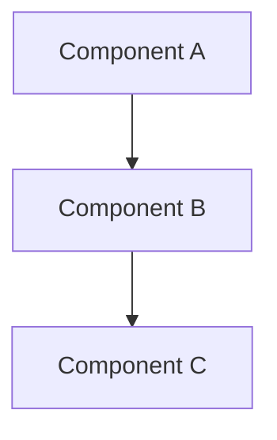

# Chapter Template

Use this template for all chapters in the Physical AI & Humanoid Robotics book.

```markdown
---
sidebar_position: [N]
---

# Chapter [N]: [Title]

## Learning Objectives

By the end of this chapter, you will be able to:

- [Objective 1 - Action verb + measurable outcome]
- [Objective 2 - Action verb + measurable outcome]
- [Objective 3 - Action verb + measurable outcome]

## Prerequisites

Before starting this chapter, ensure you have:

- [Prerequisite 1]
- [Prerequisite 2]
- [Hardware/Software requirement if applicable]

## Introduction

[2-3 paragraphs introducing the topic, its importance, and what will be covered]

## [Main Section 1]

[Content with clear explanations]

### [Subsection 1.1]

[Detailed content]

### Code Example: [Descriptive Name]

```python
#!/usr/bin/env python3
"""
[Brief description of what this code does]
"""

import rclpy
from rclpy.node import Node

class ExampleNode(Node):
    def __init__(self):
        super().__init__('example_node')
        # Implementation

def main(args=None):
    rclpy.init(args=args)
    node = ExampleNode()
    rclpy.spin(node)
    node.destroy_node()
    rclpy.shutdown()

if __name__ == '__main__':
    main()
```

**Explanation**: [Line-by-line or block explanation of the code]

## [Main Section 2]

[Content continues...]

### Diagram: [Descriptive Name]



*Figure [N]: [Caption describing the diagram]*

## [Main Section 3]

[Content continues...]

:::tip
[Helpful tip or best practice]
:::

:::warning
[Important warning or common pitfall]
:::

## Summary

In this chapter, you learned:

- [Key takeaway 1]
- [Key takeaway 2]
- [Key takeaway 3]

## Exercises

1. **[Exercise Title]**: [Description of hands-on exercise]
2. **[Exercise Title]**: [Description of hands-on exercise]
3. **[Exercise Title]**: [Description of hands-on exercise]

## References

- [Author, A. A. (Year). Title of work. Publisher. URL](link)
- [Author, B. B., & Author, C. C. (Year). Title of article. *Journal Name*, Volume(Issue), pages. DOI](link)
```

## Template Requirements

### Mandatory Elements

1. **Front matter**: `sidebar_position` for navigation ordering
2. **Learning Objectives**: 3 measurable objectives using action verbs
3. **Prerequisites**: Clear list of required knowledge/tools
4. **Code Examples**: Minimum 3 per chapter (ROS 2 modules)
5. **Summary**: Bullet points of key takeaways
6. **References**: APA 7th edition format

### Code Example Guidelines

- Include language identifier (python, bash, yaml, xml, etc.)
- Add explanatory comments
- Provide post-code explanation
- Test all examples before inclusion
- Target ROS 2 Humble Hawksbill

### Diagram Guidelines

- Use Mermaid for flowcharts, sequence diagrams, architecture
- Store static images in `/static/img/book/module[N]/`
- Include descriptive captions
- Add alt text for accessibility

### Quality Checklist

- [ ] All code examples tested and working
- [ ] All claims have citations
- [ ] Flesch-Kincaid Grade 9-12
- [ ] Word count 2,000-5,000
- [ ] No plagiarism
- [ ] Links validated
