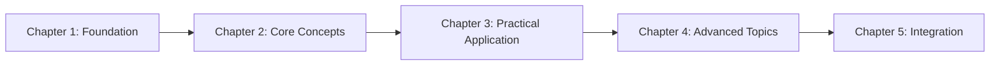

# Module Template

Use this template for module overview pages in the Physical AI & Humanoid Robotics book.

```markdown
---
sidebar_position: [N]
---

# Module [N]: [Title]

## Overview

[2-3 paragraphs providing a high-level introduction to the module's topic, its importance in humanoid robotics, and how it fits into the overall book narrative]

## Learning Objectives

By completing this module, you will:

- [High-level objective 1]
- [High-level objective 2]
- [High-level objective 3]
- [High-level objective 4]

## Hardware Requirements

| Component | Minimum | Recommended |
|-----------|---------|-------------|
| CPU | [X] cores | [Y] cores |
| RAM | [X] GB | [Y] GB |
| Storage | [X] GB | [Y] GB |
| GPU | [Minimum spec] | [Recommended spec] |
| OS | Ubuntu 22.04 | Ubuntu 22.04 |

:::note Software Versions
This module targets:
- [Tool 1]: [Version]
- [Tool 2]: [Version]
- [Tool 3]: [Version]
:::

## Prerequisites

Before starting this module, you should have:

- [Prerequisite knowledge 1]
- [Prerequisite knowledge 2]
- [Completed Module X] (if applicable)

## Chapters

1. **[Chapter 1 Title](./chapter1-slug)**
   [Brief 1-2 sentence description]

2. **[Chapter 2 Title](./chapter2-slug)**
   [Brief 1-2 sentence description]

3. **[Chapter 3 Title](./chapter3-slug)**
   [Brief 1-2 sentence description]

4. **[Chapter 4 Title](./chapter4-slug)**
   [Brief 1-2 sentence description]

5. **[Chapter 5 Title](./chapter5-slug)**
   [Brief 1-2 sentence description]

## Key Concepts

This module covers the following key concepts:

- **[Concept 1]**: [Brief definition]
- **[Concept 2]**: [Brief definition]
- **[Concept 3]**: [Brief definition]
- **[Concept 4]**: [Brief definition]

## What You'll Build

By the end of this module, you will have built:

- [Project/artifact 1]
- [Project/artifact 2]
- [Project/artifact 3]

## Module Architecture



*Figure: Learning progression through Module [N]*

## Troubleshooting

Having issues? Check the [Troubleshooting Guide](./troubleshooting) for common problems and solutions.
```

## Template Requirements

### Mandatory Elements

1. **Front matter**: `sidebar_position` for navigation
2. **Overview**: Clear module introduction
3. **Hardware Requirements**: Per-module specs (FR-021)
4. **Software Versions**: Pinned versions (FR-023)
5. **Chapter Links**: Complete list with descriptions
6. **Key Concepts**: Glossary of module terms
7. **Troubleshooting Link**: Reference to troubleshooting section (FR-022)

### Hardware Requirements Table

Each module MUST include hardware requirements based on research.md:

- **Module 1 (ROS 2)**: Minimal GPU requirements
- **Module 2 (Digital Twin)**: NVIDIA GTX 1060+ for Unity/Gazebo
- **Module 3 (Isaac)**: NVIDIA RTX 2070+ required
- **Module 4 (VLA)**: NVIDIA RTX 3060+ for LLM inference

### Quality Checklist

- [ ] Hardware requirements accurate
- [ ] Software versions match FR-023
- [ ] All chapter links valid
- [ ] Key concepts comprehensive
- [ ] Troubleshooting section linked
